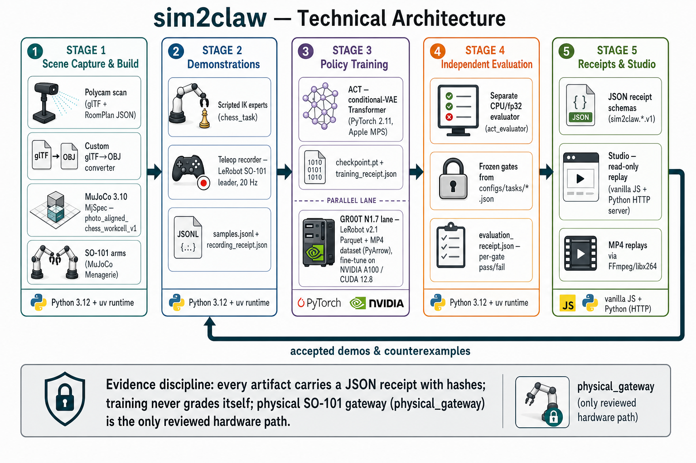
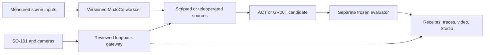

# sim2claw

**Evidence-first, clean-room simulation-to-robot manipulation for low-cost
SO-101 arms.**



sim2claw turns a measured tabletop workcell into a MuJoCo simulation, produces
versioned manipulation sources, trains or evaluates policy candidates, and
keeps the resulting traces, videos, and receipts inspectable in a browser
Studio. The central rule is simple: training never grades itself, and a
simulation result is never relabeled as physical success.

The current workcell uses a 100 mm robotward board registration, sixteen pawns,
two articulated SO-101 arms, an owner-measured follower mass profile, and a
visual Antler mug prop. Historical 72 mm scenes and frozen task identities are
retained separately instead of being rewritten.

## What is included

- A programmatic MuJoCo 3.10 workcell that compiles, steps, renders, and exposes
  versioned board, robot, prop, and camera identities.
- A loopback-only Studio for 3D replay, process status, evidence browsing,
  source recording, guarded physical replay, and an on-demand live workspace.
- A live simulator mirror of the connected follower plus three demand-loaded
  camera views: Intel RealSense D405 wrist, Logitech C922 overhead, and a second
  Logitech workspace camera.
- Scripted source experts, frozen CPU/fp32 consequence evaluators, a narrow ACT
  rook-lift task, pawn-source adapters, and GR00T LeRobot v2.1 export tooling.
- Tracked contracts, decisions, run logs, release indexes, and tests; generated
  datasets, checkpoints, recordings, caches, and runtime output stay out of Git.

## Quick start

The verified local path is Apple Silicon macOS with
[`uv`](https://docs.astral.sh/uv/) and network access for the first dependency
sync. Python is pinned to 3.12 by the project.

```bash
git clone https://github.com/jakekinchen/sim2claw.git
cd sim2claw
./scripts/bootstrap_runtime.sh
uv run pytest -q
```

Inspect and render the current scene:

```bash
uv run sim2claw scene-info
uv run sim2claw render \
  --camera studio_overview \
  --output outputs/polycam_chess_table/studio-overview.png
```

Open Studio:

```bash
uv run sim2claw studio
```

Then visit [http://127.0.0.1:4173](http://127.0.0.1:4173). The base simulator
and Studio demo require no API key or `.env` file. FFmpeg with H.264/libx264 is
optional for MP4 export; on macOS, install it with `brew install ffmpeg`.

## Reproduce the demo

### 1. Run the deterministic simulation probe

```bash
uv run sim2claw grasp-probe
```

The command writes ignored frames, a MuJoCo body-state trace, and a receipt
under `outputs/`. This is scripted simulation evidence, not a learned-policy or
physical-robot result.

### 2. Train and independently evaluate the narrow ACT task

```bash
uv run sim2claw act-train
uv run sim2claw act-eval \
  --checkpoint outputs/polycam_chess_table/act/chess_rook_lift_v1/checkpoint.pt
```

The frozen run trains a state-based conditional-VAE Action Chunking Transformer
from eight synthetic episodes, then invokes a separately owned CPU/fp32
evaluator on held-out seed `9101`. The accepted repo-native run lifted
`black_rook_a8` by 94.88 mm. That is one bounded learned-policy simulation
episode, not a robustness or sim-to-real claim.

### 3. Inspect evidence in Studio

Studio can replay MuJoCo state traces, videos, and phase frames; browse task and
episode receipts; inspect the current 3D workcell; and collect labeled source
episodes. Saved source recordings remain unreviewed until a separate replay and
evaluator admits them.

When the expected follower is connected, the masthead `Live` indicator opens:

- **Simulator** mirrors fresh follower joints through MuJoCo forward kinematics
  with torque off and no motion authority.
- **Live Feed** starts the three camera processes only while that tab is open.
  Switching tabs, closing Live, losing the lease, or shutting down Studio stops
  the streams.

The live viewer does not establish contact, task success, camera calibration,
or learned-policy execution.

## Architecture



The main stack is Python 3.12, MuJoCo 3.10, NumPy, PyTorch, PyArrow,
FFmpeg, LeRobot-compatible SO-101 interfaces, vanilla JavaScript, and Three.js.
The browser mirrors simulator state; it is not a second physics engine.

## Current evidence

| Lane | Repo-native result | Boundary |
| --- | --- | --- |
| Current pawn source | A strict geometric C8→A6 source passed the 100 mm v3 evaluator and produced 562 admitted simulation rows. | Scripted expert evidence only. |
| ACT rook lift | One held-out simulation episode lifted the rook 94.88 mm. | No robustness, camera, gateway, or physical claim. |
| Pawn GR00T data | One 562-frame, single-view LeRobot v2.1 training episode passes the local lineage/chunk preflight. | Zero held-out rows; pinned NVIDIA loader preflight is still required before GPU training. |
| Earlier GR00T campaigns | Recovery, reward-guided, placement, and flow-consensus campaigns are preserved with terminal-negative learned-policy receipts. | No successful learned GR00T policy is claimed. |
| Physical sources and replay | Five physical source recordings are indexed; guarded command replay produced joint-response diagnostics. | Zero admitted training rows and no object/contact or board-outcome proof. |
| Live workspace | Three cameras streamed together and the follower was mirrored torque-off at MacBook-sized viewports without scrolling. | Intrinsics, AprilTag pose, hand-eye calibration, metric depth, and task success remain unverified. |

Simulation, replay, learned-policy, physical read-only, and physical task
evidence are intentionally separate proof classes.

## Data and provenance

- Frozen task/evaluator contracts live under [`configs/`](./configs/).
- Calibration identities and measured mass data live under
  [`calibration/`](./calibration/).
- Decisions and run evidence live in the [`docs/`](./docs/) index.
- Generated `datasets/`, `outputs/`, `runs/`, checkpoints, recordings, and
  credentials are ignored. They are never required to inspect the tracked
  source or proof contracts.
- The physical replay videos are Release assets rather than Git blobs; their
  tracked index and hashes are in
  [`PHYSICAL_REPLAY_RELEASE_20260719.md`](./docs/reference/PHYSICAL_REPLAY_RELEASE_20260719.md).

Polycam was an optional input to the initial scene, not a recurring setup
requirement. The bundled programmatic workcell runs without fetching Polycam
data. Owner-photo comparison requires the exact separately held image described
in [`POLYCAM_CHESS_TABLE_SCENE.md`](./docs/POLYCAM_CHESS_TABLE_SCENE.md).

This repository is a clean-room implementation. The prior project is consulted
read-only at `jakekinchen/sim2claw-imported-archive` commit `798491e` or through
the designated local read-only checkout. No implementation, dataset,
checkpoint, receipt, generated output, or runtime environment was copied from
it. See [`ARCHIVE_INDEX.md`](./docs/reference/ARCHIVE_INDEX.md) and
[`PRIOR_RESULTS_SUMMARY.md`](./docs/reference/PRIOR_RESULTS_SUMMARY.md).

## Hardware safety

The reviewed gateway is the only robot command path. Live inspection opens it
with torque disabled. Recorder and replay motion require loopback access,
explicit operator acknowledgement, identified leader/follower buses, matching
calibration, bounded synchronization, target clamps, stall detection, and
torque release on failure or shutdown.

Do not run physical replay from this README. Complete the workcell-clear and
registration procedure in
[`VISUALIZATION_STUDIO.md`](./docs/VISUALIZATION_STUDIO.md) first.

## Known limitations and next gates

- The D405 stream works, but its observed wrist pose points the optical axis
  away from the board. A mount/pose decision and new extrinsic calibration are
  required; rotating browser pixels cannot correct the optical axis.
- Camera intrinsics, AprilTag detections, camera-to-robot transforms, and
  board-to-camera transforms are not yet a frozen calibration proof.
- The latest paired-arm preflight was outside the registration guard, so the
  live-view audit issued no synchronization or physical task trial.
- The current pawn dataset is deliberately one training episode. It is enough
  to prove source-to-LeRobot mechanics, not to train or promote a useful policy.
- Current 100 mm workcell evidence does not relabel historical 72 mm physical
  recordings or frozen ACT/GR00T evaluations.

## Documentation

- [Current goal](./GOAL.md)
- [Build plan](./docs/BUILD_PLAN.md)
- [Documentation index](./docs/README.md)
- [Studio and gateway contract](./docs/VISUALIZATION_STUDIO.md)
- [Current workcell integration](./docs/run-logs/2026-07-18-unified-workcell-v3-integration.md)
- [Studio live-workspace audit](./docs/run-logs/2026-07-18-studio-live-workspace-audit.md)
- [Pawn GR00T dataset receipt](./docs/run-logs/2026-07-18-pawn-groot-dataset-v1.md)
- [Bidirectional pawn evaluation](./docs/decisions/0006-pawn-rank12-bidirectional-evaluation.md)

## Team

- Jake Kinchen — Team Lead and Robotics Engineer
- Aishwarya Badlani — Data Engineer
- Jeff Pape — Software Engineer
- Mahata Abhinav — Product Manager

## License

See [`LICENSE`](./LICENSE).
