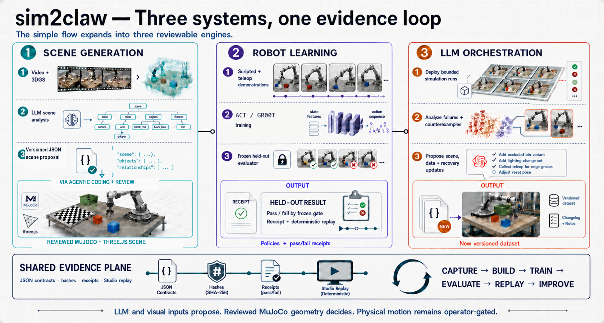
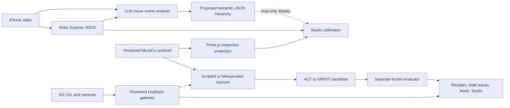

# sim2claw

**Evidence-first, clean-room simulation-to-robot manipulation for low-cost
SO-101 arms.**



sim2claw combines a repo-native MuJoCo workcell with a Robo Scanner visual
intake, produces versioned manipulation sources, trains or evaluates policy
candidates, and keeps traces, camera feeds, receipts, and a verified 3D
Gaussian Splat inspectable in browser Studio. The central rule is simple:
training never grades itself, and a visual or simulation result is never
relabeled as physical success.

The current workcell uses a 100 mm robotward board registration, sixteen pawns,
two articulated SO-101 arms, an owner-measured follower mass profile, and a
visual Antler mug prop. Historical 72 mm scenes and frozen task identities are
retained separately instead of being rewritten.

## What is included

- A programmatic MuJoCo 3.10 workcell that compiles, steps, renders, and exposes
  versioned board, robot, prop, and camera identities.
- A loopback-only Studio for 3D replay, process status, evidence browsing,
  multi-camera source/replay feeds, interactive 3DGS visual calibration,
  source recording, guarded physical replay, and an on-demand live workspace.
- A live simulator mirror of the connected follower plus three demand-loaded
  camera views: Intel RealSense D405 wrist, Logitech C922 overhead, and a second
  Logitech workspace camera.
- Scripted source experts, frozen CPU/fp32 consequence evaluators, a narrow ACT
  rook-lift task, a 12-skill B--G pawn endpoint scorecard, recorded-action
  replay/system-ID gates, pawn-source adapters, and GR00T LeRobot v2.1 export
  tooling.
- Tracked contracts, decisions, run logs, release indexes, and tests; generated
  datasets, checkpoints, recordings, caches, and runtime output stay out of Git.

## Quick start

The verified local path is Apple Silicon macOS with
[`uv`](https://docs.astral.sh/uv/) and network access for the first dependency
sync. Python is pinned to 3.12 by the project.

```bash
git clone https://github.com/jakekinchen/sim2claw.git
cd sim2claw
./scripts/bootstrap_runtime.sh
uv run pytest -q
```

Inspect and render the current scene:

```bash
uv run sim2claw scene-info
uv run sim2claw render \
  --camera studio_overview \
  --output outputs/studio-overview.png
```

Open Studio:

```bash
uv run sim2claw studio
```

Then visit [http://127.0.0.1:4173](http://127.0.0.1:4173). The base simulator
and Studio demo require no API key or `.env` file. FFmpeg with H.264/libx264 is
optional for MP4 export; on macOS, install it with `brew install ffmpeg`.

## Reproduce the demo

### 1. Run the deterministic simulation probe

```bash
uv run sim2claw grasp-probe
```

The command writes ignored frames, a MuJoCo body-state trace, and a receipt
under `outputs/`. This is scripted simulation evidence, not a learned-policy or
physical-robot result.

### 2. Train and independently evaluate the narrow ACT task

```bash
uv run sim2claw act-train
ACT_CHECKPOINT="$(find outputs -path '*/act/chess_rook_lift_v1/checkpoint.pt' -print -quit)"
uv run sim2claw act-eval \
  --checkpoint "$ACT_CHECKPOINT"
```

The frozen run trains a state-based conditional-VAE Action Chunking Transformer
from eight synthetic episodes, then invokes a separately owned CPU/fp32
evaluator on held-out seed `9101`. The accepted repo-native run lifted
`black_rook_a8` by 94.88 mm. That is one bounded learned-policy simulation
episode, not a robustness or sim-to-real claim.

### 3. Inspect evidence in Studio

Studio can replay MuJoCo state traces independently from recorded videos and
phase frames; switch among synchronized source, overhead, side, and wrist
feeds; browse task and episode receipts; inspect the current 3D workcell; orbit
and place the exact Robo Scanner Gaussian Splat in the Calibration view; inspect
the LLM-proposed JSON scene hierarchy; compare it with the accepted Three.js
scene projection; and collect labeled source episodes. Saved source recordings
remain unreviewed until a separate replay and evaluator admits them.

When the expected follower is connected, the masthead `Live` indicator opens:

- **Simulator** mirrors fresh follower joints through MuJoCo forward kinematics
  with torque off and no motion authority.
- **Live Feed** starts the three camera processes only while that tab is open.
  Switching tabs, closing Live, losing the lease, or shutting down Studio stops
  the streams.

The live viewer does not establish contact, task success, camera calibration,
or learned-policy execution.

## Architecture



The main stack is Python 3.12, MuJoCo 3.10, NumPy, PyTorch, PyArrow,
FFmpeg, LeRobot-compatible SO-101 interfaces, vanilla JavaScript, and Three.js.
The LLM may propose objects, relationships, and approximate geometry from the
video and 3DGS, but it does not establish metric scale, collision geometry,
task coordinates, evaluator proof, or physical authority. Studio displays the
JSON hierarchy beside a Three.js projection built independently from the
accepted MuJoCo manifest. The current code does not consume hierarchy body-name
hints, compile the JSON, promote it, or use it to drive MuJoCo or Three.js; the
browser is not a second physics engine.

## Current evidence

| Lane | Repo-native result | Boundary |
| --- | --- | --- |
| Current pawn source | A strict geometric C8→A6 source passed the 100 mm v3 evaluator and produced 562 admitted simulation rows. | Scripted expert evidence only. |
| ACT rook lift | One held-out simulation episode lifted the rook 94.88 mm. | No robustness, camera, gateway, or physical claim. |
| Pawn GR00T development | A bounded Brev A100 run completed 1000/1000 training steps. Its sole frozen C8→A6 development rollout was terminal negative: 0 mm lift, 125.724 mm final XY error, 13/15 gates. | Held-outs remained sealed, checkpoint weights were not retained, and no successful GR00T policy is claimed. |
| Earlier GR00T campaigns | Recovery, reward-guided, placement, and flow-consensus campaigns are preserved with terminal-negative learned-policy receipts. | No successful learned GR00T policy is claimed. |
| B--G endpoint benchmark | The v2 scorecard freezes 12 directed skills. All 18 human-teleoperated recording directories and 54 catalog-bound assets are retained in 36 review panels. | These are source trajectories, not learned-policy executions; zero base-center poses and zero compatible B--G ACT checkpoints are admitted, so no policy, centering, drift, or composition result is claimed. |
| Recorded replay and system ID | The replay/sysid implementation requires measured initial velocities and units, exact unclipped actions, immutable episode splits, object-state provenance, and observable sensitivity. | The canonical input report admits 0/18 episodes; no physical replay, parameter fit, calibration, held-out improvement, or promotion occurred. |
| B--G language semantics | Twelve exact move meanings and 24 deterministic train prompt strings are frozen with group-before-expansion leakage controls. | There are zero admitted current-geometry source groups and zero B--G training rows; prompt variants are not behavioral evidence. |
| Live workspace | Three cameras streamed together and the follower was mirrored torque-off at MacBook-sized viewports without scrolling. | Intrinsics, AprilTag pose, hand-eye calibration, metric depth, and task success remain unverified. |

Simulation, replay, learned-policy, physical read-only, and physical task
evidence are intentionally separate proof classes.

## Data and provenance

- Frozen task/evaluator contracts live under [`configs/`](./configs/).
- Calibration identities and measured mass data live under
  [`calibration/`](./calibration/).
- Decisions and run evidence live in the [`docs/`](./docs/) index.
- Generated `datasets/`, `outputs/`, `runs/`, checkpoints, recordings, and
  credentials are ignored. They are never required to inspect the tracked
  source or proof contracts.
- The physical replay videos are Release assets rather than Git blobs; their
  tracked index and hashes are in
  [`PHYSICAL_REPLAY_RELEASE_20260719.md`](./docs/reference/PHYSICAL_REPLAY_RELEASE_20260719.md).

The current presentation and Studio path uses Robo Scanner iPhone-video 3DGS
for visual context and calibration. The bundled MuJoCo workcell remains a
separate programmatic physics surface and does not derive metric scale,
collision geometry, or task coordinates from the splat. Earlier scan-alignment
notes are retained only as historical evidence and are not the current intake.

This repository is a clean-room implementation. The prior project is consulted
read-only at `jakekinchen/sim2claw-imported-archive` commit `798491e` or through
the designated local read-only checkout. No implementation, dataset,
checkpoint, receipt, generated output, or runtime environment was copied from
it. See [`ARCHIVE_INDEX.md`](./docs/reference/ARCHIVE_INDEX.md) and
[`PRIOR_RESULTS_SUMMARY.md`](./docs/reference/PRIOR_RESULTS_SUMMARY.md).

### Robo Scanner iPhone-video 3DGS pathway

`sim2claw iphone-3dgs` is a clean-room, local-only path from one MOV to a
relative-scale Gaussian PLY. It requires explicit public FFmpeg, ffprobe,
COLMAP, and Brush executables and writes every frame, database, model, log,
candidate, and receipt below an ignored `artifacts/private` run directory.

```bash
uv run sim2claw iphone-3dgs \
  --video /path/to/capture.MOV \
  --output artifacts/private/iphone-3dgs/my-run \
  --ffmpeg /opt/homebrew/bin/ffmpeg \
  --ffprobe /opt/homebrew/bin/ffprobe \
  --colmap /path/to/colmap \
  --brush /path/to/brush_app
```

The command freezes a holdout before reconstruction and labels the result
`monocular_video_relative_scale_3dgs`. It does not claim metric scale, RGB-D,
collision geometry, held-out acceptance, learned-policy evidence, or robot
authority. A checksummed release can be placed in the ignored private-release
directory and then appears automatically in Studio's Calibration view. See
[`docs/decisions/0008-clean-room-iphone-video-3dgs.md`](./docs/decisions/0008-clean-room-iphone-video-3dgs.md).

## Hardware safety

The reviewed gateway is the only robot command path. Live inspection opens it
with torque disabled. Recorder and replay motion require loopback access,
explicit operator acknowledgement, identified leader/follower buses, matching
calibration, bounded synchronization, target clamps, stall detection, and
torque release on failure or shutdown.

Do not run physical replay from this README. Complete the workcell-clear and
registration procedure in
[`VISUALIZATION_STUDIO.md`](./docs/VISUALIZATION_STUDIO.md) first.

## Known limitations and next gates

- The D405 stream works, but its observed wrist pose points the optical axis
  away from the board. A mount/pose decision and new extrinsic calibration are
  required; rotating browser pixels cannot correct the optical axis.
- Camera intrinsics, AprilTag detections, camera-to-robot transforms, and
  board-to-camera transforms are not yet a frozen calibration proof.
- The latest paired-arm preflight was outside the registration guard, so the
  live-view audit issued no synchronization or physical task trial.
- The current pawn dataset is deliberately one training episode. It proved the
  source-to-LeRobot and bounded training mechanics, but the only development
  rollout was terminal negative and no useful policy was promoted.
- Seven product-scope catalog task labels conflict with their recording-folder
  labels and have owner-reviewed folder-label corrections for qualitative
  review; five out-of-scope rows remain excluded. All 26 product image-space
  markers are owner-reviewed, but none is an admitted metric pose. This still
  blocks per-skill physical endpoint regression and leave-one-column-out
  calibration claims.
- The owner-reported four-to-five rubber-band wraps on each fingertip are an
  unmeasured contact prior. Their mass effect is intentionally excluded as
  negligible per the owner's assessment; dimensions, friction, compliance,
  and which recording sessions used the wraps are not calibrated physical
  parameters.
- Current 100 mm workcell evidence does not relabel historical 72 mm physical
  recordings or frozen ACT/GR00T evaluations.

## Documentation

- [Current goal](./GOAL.md)
- [Build plan](./docs/BUILD_PLAN.md)
- [Documentation index](./docs/README.md)
- [Studio and gateway contract](./docs/VISUALIZATION_STUDIO.md)
- [Current workcell integration](./docs/run-logs/2026-07-18-unified-workcell-v3-integration.md)
- [Studio live-workspace audit](./docs/run-logs/2026-07-18-studio-live-workspace-audit.md)
- [Pawn GR00T dataset receipt](./docs/run-logs/2026-07-18-pawn-groot-dataset-v1.md)
- [B--G product evaluator and endpoint evidence](./docs/run-logs/2026-07-19-pawn-bidirectional-composability-eval.md)
- [Bidirectional pawn composability diagnostic](./docs/decisions/0009-pawn-bidirectional-composability-evaluation.md)
- [Recorded-action replay and system-ID boundary](./docs/run-logs/2026-07-19-recorded-action-replay-sysid.md)
- [B--G language semantics gate](./docs/run-logs/2026-07-19-pawn-b-g-language-semantics.md)

## Team

- Jake Kinchen — Team Lead and Robotics Engineer
- Aishwarya Badlani — Data Engineer
- Jeff Pape — Software Engineer
- Mahata Abhinav — Product Manager

## License

See [`LICENSE`](./LICENSE).
