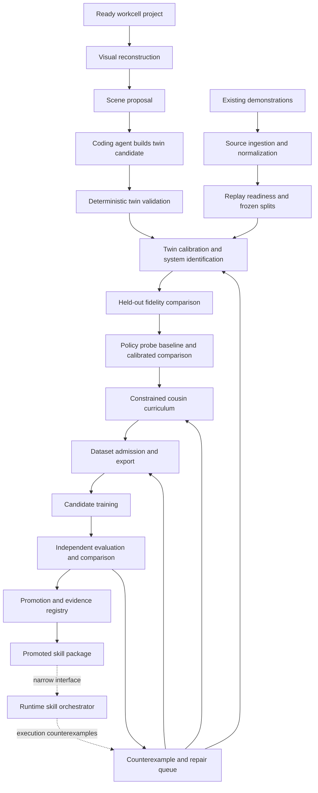

# Learning Factory Automation Map

**Status:** hardware-free deterministic integration and recursive control loop
implemented; live physical B--G campaign blocked at LF-05

**Codex execution task:**
[`../autonomous-workflow/goal-loop-learning-factory.md`](../autonomous-workflow/goal-loop-learning-factory.md)

**Accepted code snapshot:** 2026-07-19, branch
`codex/task-orchestrator-plan` at `416eb77`

## Objective

Turn the existing Sim2Claw commands and contracts into a resumable learning
factory that takes a ready workcell, visual evidence, and demonstrations and
produces calibrated twin candidates, admitted datasets, trained policy
candidates, independent evaluations, counterexamples, and promotion receipts.

The Studio Task Orchestrator is a downstream runtime, not part of this factory.
The learning factory publishes promoted skill packages to it and may later
consume its execution counterexamples. It does not share training or promotion
authority with the runtime.

## Current proof boundary

The factory now directly invokes its deterministic component APIs through all
fourteen stages, including a dataset-consuming goal-conditioned ACT trainer,
separate calibration and policy evaluator processes, executable child
generations, and an independent promotion process. Studio exposes the same
receipts with generation history and immutable-artifact drilldown. See
[`../run-logs/2026-07-19-learning-factory-buildout.md`](../run-logs/2026-07-19-learning-factory-buildout.md)
for current real-component and terminal-negative evidence.

The paragraphs below retain the original scaffold boundary as historical
context. They no longer describe the implementation state, but their physical
and claim-boundary warnings remain in force.

The repository contains substantial deterministic machinery for
runtime inspection, iPhone-video 3DGS generation, source episode schemas,
replay, staged system identification, ACT training/evaluation, GR00T dataset
export/preflight, consequence evaluation, project bundles, receipts, and Studio
inspection. The learning-factory scaffold provides an executable
LF-00-through-LF-13 graph, atomic stage receipts, dependency-aware execution and
resume, mechanism-level evidence contracts, a synthetic controller fixture,
and a read-only Studio rail. It does not yet join most of those real component
APIs into LF-01 through LF-13. The synthetic fixture proves controller
transitions only; literal outputs, caller-supplied metrics, and caller-supplied
verdict flags are not component execution evidence.

The existing `pipeline-stage` surface is project-bound and truth-preserving,
but currently reports static `passed`, `partial`, or `blocked` state. It does
not execute calibration, dataset construction, training, candidate comparison,
or promotion. The newer `factory-*` command family is the executable product
surface; the bounded NemoClaw pipeline remains available for its original
scope.

Current B--G physical inputs remain fail-closed:

- 0/18 recordings are ready for exact joint/timing replay;
- the physical-to-simulator joint transform remains provisional;
- metric object/contact/grasp/release observables are absent;
- no project parameter fit or held-out calibration evaluation has run;
- no B--G training rows or compatible promoted checkpoint exist; and
- the Codex-authored scene hierarchy is a display-only proposal and does not compile into
  MuJoCo geometry.

Automation must preserve these blockers as useful outcomes. It must not work
around them by weakening contracts, opening held-outs, clipping requested
actions, or treating a Codex proposal as evidence.

## Ownership model

Every stage has exactly one proof owner. A workflow controller may invoke a
stage, but invocation does not transfer verdict authority.

| Owner | Responsibility | May produce proof-bearing verdicts? |
| --- | --- | --- |
| Learning Factory Controller | Stage dependencies, hashes, leases, resume, retries, receipts, and resource cleanup | No; it records component verdicts |
| Deterministic Component | Reconstruction, replay, fitting, compilation, dataset conversion, training, and trace extraction | Only for its declared mechanical contract |
| Codex Executor | Scene code, hypotheses, semantic cousins, failure explanations, repairs, navigation, and stage execution | No; authored outputs remain candidates until their declared gate passes |
| Independent Evaluator | Frozen CPU/fp32 consequences, held-out fidelity, candidate comparison, and promotion eligibility | Yes, within its frozen contract |
| Human/Operator | Workcell readiness, measurements, ambiguous annotation, paid budget, physical safety, and final external authorization | Yes, only for explicitly human-owned gates |
| Trainer | Optimization and checkpoint production | No; training cannot promote itself |
| Runtime Skill Orchestrator | Consumes promoted skills and returns execution traces | No training, admission, evaluation, or promotion authority |

No end-to-end stage is proven by Codex judgment alone. Codex runs the workflow
and authors proposals, while deterministic components and separate evaluators
own their declared gates. The product does not require a secondary LLM provider.

## System map



## Stage input, output, and ownership contracts

| ID | Part | Required inputs | Outputs | Primary owner | Codex judgment | Current automation |
| --- | --- | --- | --- | --- | --- | --- |
| LF-00 | Project/workcell intake | Project manifest; robot and camera identities; calibration files; task/evaluator references; demonstration catalog | Hash-bound inspection; accepted input inventory; precise blockers | Project Intake Validator | None | Strong components: `project-inspect`, `doctor`, project bundle inspection; not joined into a factory run |
| LF-01 | Visual reconstruction | Source video; explicit FFmpeg/ffprobe/COLMAP/Brush identities; frozen reconstruction settings | Relative-scale 3DGS; frames; camera reconstruction; hashes; reconstruction receipt | Reconstruction Runner | Optional proposal of semantic observations; never metric authority | One-command `iphone-3dgs`; held-out photometric admission remains future work |
| LF-02 | Scene proposal and simulation synthesis | Workcell manifest; video/3DGS receipts; measurements; upstream robot assets; task scope | Typed scene proposal; candidate MuJoCo code/assets/config; dependency/provenance manifest | Codex Scene Builder | **Primary candidate author:** semantic decomposition, code generation, geometry/physics hypotheses | JSON proposal exists but is display-only; simulation authoring remains Codex-driven and unchained |
| LF-03 | Twin compile and baseline validation | Candidate scene; frozen measurements; robot model; task fixtures; render cameras | Compile/stability/collision/render reports; scene manifest; baseline twin candidate receipt | Twin Validator | May diagnose failures and propose patches; cannot pass the gate | Strong render, doctor, scene tests, trace, grasp, and contact-sensitivity components; no unified twin-admission receipt |
| LF-04 | Demonstration ingestion | Existing action/state/video payloads; units; clocks; device identities; task labels; hashes | Canonical source episodes; normalized catalog; conflicts and missing-observable report | Source Ingestor | May propose label/phase annotations; ambiguous changes require review | Strong schemas, recorder, catalog, evidence preparation, and hash checks; batch readiness currently ends blocked |
| LF-05 | Replay readiness and split freeze | Canonical episodes; joint transform; units; initial state/velocity; object state; evaluator contract | Exact replay eligibility; immutable whole-episode calibration/validation/held-out split; blocker receipt | Replay Contract Evaluator | None for eligibility; may explain a blocker afterward | Implemented with `sysid-input-report`, limit audit, replay, and `sysid-freeze-split`; not composed |
| LF-06 | Twin calibration/system identification | Baseline twin; eligible calibration episodes; frozen parameter families/bounds; split | Versioned calibrated twin candidate; fit receipt; per-stage residuals; sensitivity report | System Identification Runner | Proposes parameter families, priors, techniques, and next experiments | Staged bounded implementation exists; current physical inputs permit no fit |
| LF-07 | Before/after fidelity and policy probes | Baseline and calibrated twin candidates; frozen validation episodes; frozen ACT policy cohort; evaluator | Fidelity delta; policy success delta; sim/real discrepancy; failure/ranking agreement; calibration verdict | Calibration Evaluator / Policy Probe Bench | May summarize discrepancies and suggest hypotheses | Residual evaluation and narrow ACT evaluation exist separately; no bound before/after comparison artifact |
| LF-08 | Cousin proposal and curriculum | Admitted twin; uncertainty map; promoted source skills; counterexamples; allowed variation envelope | Versioned object/scene/task cousin proposals; curriculum batches; lineage and coverage map | Cousin Compiler plus Curriculum Planner | **Primary semantic proposer:** useful cousin/task hypotheses and difficulty ordering | Goal/retarget contracts exist; no general cousin compiler or curriculum controller |
| LF-09 | Candidate replay and dataset admission | Cousin candidates; source lineage; IK/planner identities; frozen evaluator and splits | Accepted/rejected episodes with reasons; ACT rows; GR00T dataset; zero-row-held-out proof; dataset receipt | Dataset Admission Evaluator and Dataset Builder | May propose repairs as new candidates only | Source evaluator/adapters and GR00T export/preflight are implemented; no one-command batch chain |
| LF-10 | Candidate training | Admitted dataset receipt; frozen recipe; runtime/model identity; budget and resource lease | Checkpoints; optimizer/train logs; checkpoint manifests; terminal status | ACT/GR00T Trainer | May choose among pre-authorized recipes or propose a new experiment for review | Narrow ACT is local and repeatable; GR00T campaign scripts are bounded but campaign-specific and externally coordinated |
| LF-11 | Independent evaluation and comparison | Immutable checkpoint manifests; frozen evaluator/held-outs; runtime identity; baseline candidates | Per-gate consequences; comparable scorecard; candidate ranking; terminal-negative or eligible result | Separate CPU/fp32 Evaluator | May explain failures; cannot change scores, select by prose, or open held-outs | Strong task evaluators and identity checks; cross-candidate leaderboard/promotion input is not unified |
| LF-12 | Counterexample and repair queue | Failed traces; evaluator gates; twin/checkpoint identities; split/proof class | Typed failure bundle; regression fixture; calibration/cousin/data/implementation routing; repair-candidate lineage | Counterexample Manager; admission remains evaluator-owned | **Primary diagnosis proposer:** failure attribution and repair hypotheses | Failure traces exist in several lanes; no common counterexample envelope, deduplication, or routing queue |
| LF-13 | Evidence, promotion, and registry | Candidate evaluation; calibration verdict; dataset/checkpoint/runtime identities; authority contract | Signed/digested promotion or rejection receipt; candidate registry entry; optional promoted skill package | Promotion Engine / Independent Evaluator | May draft summaries only | Project bundles, deployment receipts, Studio, and proof classes exist; promotion is not a reusable learning-factory service |

## Codex-driven judgment and authoring

The following work intentionally uses Codex judgment at proposal time:

1. **Simulation authoring:** turn typed visual/workcell evidence into candidate
   scene code, assets, configuration, and tests.
2. **Calibration experiment design:** propose parameter families, priors,
   fitting techniques, and the next informative experiment.
3. **Semantic cousin design:** propose meaningful object, layout, and task
   variations within a deterministic variation envelope.
4. **Failure attribution:** explain traces, identify likely mechanisms, and
   propose repair candidates or missing evidence.
5. **Research summarization:** explain before/after changes and recommend the
   next bounded campaign.

For all five, the authored output is `proposal`, never `accepted` merely because
Codex produced it. Codex invokes the whole workflow, but input hashes, exact
replay, split assignment, physics compilation, strict-success admission,
held-out verdicts, checkpoint promotion, resource teardown, and physical
authority remain owned by their explicit contracts. No second model service is
required.

## Cross-cutting contracts to automate once

Every factory run should share these facilities instead of reimplementing them
per model or task:

- content-addressed artifact manifests and immutable input identities;
- stage states: `not_ready`, `ready`, `running`, `passed`, `partial`, `blocked`,
  `failed`, and `superseded`;
- dependency-aware `--resume` and hash-based no-op behavior;
- atomic stage receipts with start/end time, code/runtime identity, inputs,
  outputs, verdict owner, and proof class;
- separate train, calibration, validation, debug, and sealed held-out roles;
- resource leases, maximum cost/runtime, artifact recovery, and mandatory Brev
  inventory/teardown verification for explicitly Brev-backed campaigns;
- Studio activity events and read-only run inspection; and
- a single counterexample identity so one failure is not silently copied into
  multiple training pools.

## Priority list

### P0 — Wire the deterministic spine first

These are the fastest, highest-leverage changes because their component
commands already exist and they require little or no new research.

1. **Learning-factory run manifest and DAG/resume controller — small/medium.**
   Replace static stage reporting with a project-declared graph whose adapters
   invoke existing component functions. Preserve blocked results. Add
   `factory-run`, `factory-status`, and `--resume` without adding a secondary
   model call or provider configuration.
2. **Batch source-to-dataset chain — small.** Compose source inventory, replay
   readiness, split freeze, source evaluation, adaptation, dataset export, and
   local preflight. Stop before adaptation whenever admission fails.
3. **Local ACT candidate campaign — small.** Chain one admitted dataset to
   training, immutable checkpoint capture, separately invoked evaluation, and
   a candidate result receipt. Use the frozen narrow ACT fixture first to prove
   mechanics without making a B--G claim.
4. **Before/after calibration comparison receipt — medium.** Bind baseline and
   calibrated twin identities to residual metrics and a frozen ACT policy
   cohort. Report sim/real discrepancy and failure agreement; do not optimize
   for higher simulated ACT success alone.
5. **Common counterexample envelope — small/medium.** Normalize failed traces
   from replay, ACT, and GR00T into one hash-bound schema and route each to
   calibration, cousin generation, data repair, implementation repair, or
   regression-only storage.

### P1 — Make the calibration loop useful

6. **Calibration experiment specification and bounded runner — medium.** Allow
   the agent to propose parameter families and techniques, then compile those
   proposals into reviewed bounds and deterministic fit jobs.
7. **Twin admission receipt — medium.** Join compile, stability, collision,
   render, replay, held-out improvement, and sensitivity into one evaluator-
   owned candidate verdict.
8. **Candidate leaderboard and promotion service — medium.** Compare immutable
   candidates on a shared evaluator and publish rejection or promotion without
   trainer authority.

### P2 — Add constrained recursive growth

9. **First cousin compiler — medium/large.** Start with continuous source and
   target pose cells plus known distractor layouts. Compile typed variations,
   replay all of them, and retain explicit rejection reasons.
10. **Curriculum and coverage planner — medium.** Select the next batch from
    uncertainty, coverage gaps, and counterexamples; prevent oversampling easy
    near-duplicates.
11. **Repair-data admission loop — medium.** Admit only validated
    `failed prefix -> intervention -> successful corrective suffix` records;
    never train on held-out failures.

### P3 — Productize Codex navigation and scaled surfaces

12. **Codex Scene Builder stage — large.** Give Codex a typed scene proposal
    and bounded workspace, collect its patch and dependency
    manifest, run validation, and return structured failures for repair.
13. **Codex task navigation and proposal schemas — medium.** Make each stage
    expose the exact context, proposal schema, validator, blocker, and next
    action Codex needs. Do not add an external model-provider surface.
14. **Unified paid-campaign controller — medium/large.** Provision, verify,
    launch, monitor, evaluate, recover artifacts, and tear down Brev resources
    under an explicit budget and lease. Do not start this until a dataset and
    evaluator are already admitted.

## First implementation slice

The first slice should prove orchestration rather than new robotics capability:

```text
project inspect
  -> runtime doctor
  -> source inventory/readiness
  -> immutable stage receipt
  -> blocked or ready transition
  -> resume without rerunning unchanged stages
```

Then extend the same graph on a synthetic/frozen local fixture:

```text
admitted source
  -> dataset build/preflight
  -> ACT train
  -> independent ACT eval
  -> candidate rejection/eligibility receipt
```

Acceptance criteria:

- one project manifest deterministically resolves the same stage graph;
- every stage binds exact input and output hashes;
- unchanged passed stages are not rerun on `--resume`;
- a blocked stage prevents dependent training without becoming an error;
- Codex can run the deterministic spine without a secondary model service;
- no held-out rows are consumed by training;
- training cannot write a promotion decision;
- generated outputs remain below ignored artifact roots;
- the run is inspectable in Studio; and
- no physical or paid-compute authority is introduced.

## Deferred from the learning factory

- dynamic runtime composition of promoted skills;
- remote camera polling for task execution;
- runtime base-case restoration;
- raw joint or servo generation by Codex or a runtime model;
- automatic physical deployment after simulation success; and
- broad object/task cousins before continuous-pose cousins pass strict replay.

Those belong to the runtime orchestrator or later curriculum tiers. The only
current interfaces are a promoted skill package leaving LF-13 and a typed
execution counterexample entering LF-12.
