# SAIL/ClawLoop Grand Master Plan

Status: `ACTIVE — PHASE 1`

Program type: two-phase, evidence-gated research and implementation program

Primary method: **SAIL — Structure-Adaptive Interventional Loop Closure**

System: **ClawLoop — an evidence-gated agentic digital-twin and policy-learning
factory**

This is the single execution plan for the next Sim2Claw program. It consolidates
the retained-data fidelity investigation, SAIL methodology, Inspect/GapBench
agent evaluation, Learning Factory, TwinWorthiness certification, downstream
ACT/GR00T work, publication evidence, and the later related-workcell hardware
study into one ordered program.

Existing decisions, frozen contracts, run logs, and research notes retain their
historical and evidentiary roles. They do not define a competing execution
order. If this plan is activated in `GOAL.md`, future slices should use the
milestone ledger here rather than reconstructing a plan from chat history.

---

## 1. Mission

Build and evaluate a system in which deterministic calibration machinery and
bounded coding/reasoning agents diagnose a robot simulator's residual errors,
propose missing physical mechanisms, select discriminating interventions,
reopen earlier calibration decisions when a new mechanism invalidates them,
and certify whether the resulting digital twin is fit for a declared downstream
use.

The action-frozen calibration lane must preserve every retained policy or
teleoperation action byte exactly. The system may alter only declared simulator
mechanisms, timing semantics, scene state, and calibrated physical parameters.
It may not improve calibration evidence by applying IK, action offsets,
clipping, corrective suffixes, or other assistance to the source policy.

The program has two phases:

1. **Phase 1 — no new physical data:** implement almost the entire system,
   compile the retired-workcell evidence, run seeded synthetic and prospective
   simulator experiments, benchmark deterministic and agentic loop closure,
   produce TwinWorthiness verdicts, prepare downstream policy infrastructure,
   and assemble the paper package.
2. **Phase 2 — related-workcell hardware verification:** once the SO-101 and
   chessboard are available and separately authorized, identify the setup as a
   new related workcell, collect a small high-signal calibration and evaluation
   package, test SAIL's prospective predictions, and only then evaluate a
   frozen policy on hardware if the relevant gates pass.

Phase 1 is intentionally much larger. Lack of new physical data must not block
software completeness, synthetic causal evaluation, retrospective analysis,
prospective simulator evidence, or a publication-ready methods result.

---

## 2. Intended outcome

At the end of Phase 1, the repository should provide:

- one typed, content-addressed calibration evidence model;
- one phase-aligned residual field spanning robot, gripper, camera, object,
  contact, timing, and consequence channels;
- one sparse belief graph over parameters, mechanisms, evidence, simulator
  versions, interventions, and downstream policies;
- one deterministic SAIL loop-closure implementation;
- one mechanism plugin ABI and bounded posterior-fitting path;
- one structural-discrimination acquisition policy;
- one evaluator-owned TwinWorthiness certificate;
- one seeded, sealed benchmark that distinguishes structural recovery from
  parameter fitting;
- one governed Inspect task that compares coding/reasoning agents under the
  same tools, budgets, cases, and evaluator;
- one honest retired-workcell case study with explicit retrospective limits;
- one prospective simulator-only case study whose hypotheses and gates were
  frozen before the new runs;
- one Learning Factory path from calibrated twin to admitted simulation data,
  ACT/GR00T candidates, and counterexamples, held closed whenever the twin is
  unfit;
- one read-only Studio view of residuals, graph revisions, interventions,
  action identity, replay outcomes, and proof class;
- one reproducible paper artifact map with baselines, ablations, statistics,
  claims, and negative results; and
- one frozen hardware execution packet that requires no method redesign when
  the arm returns.

At the end of Phase 2, the repository should additionally provide:

- a hash-bound identity and calibration package for the new related workcell;
- synchronized command, bus, joint, camera, object, gripper, and consequence
  traces;
- pre-registered mechanism-discrimination results;
- a warm-start-versus-cold-start calibration comparison;
- a prospective TwinWorthiness verdict for the new workcell;
- if eligible, a small frozen hardware policy evaluation over three declared
  scenarios; and
- an evaluator-owned final claim that is no stronger than the evidence.

---

## 3. Source of truth and authority order

Use the following order. A lower item may explain a higher item but may not
silently override it.

1. The latest explicit owner instruction.
2. `AGENTS.md`, including clean-room, proof-class, gateway, held-out,
   generated-artifact, and paid-compute boundaries.
3. Frozen task, evaluator, split, hardware-authority, and campaign contracts
   under `configs/`, plus the exact source and action hashes they bind.
4. The live implementation, tests, source bytes, ignored receipts, and
   evaluator outputs in the selected checkout.
5. This plan for program sequencing, milestones, acceptance criteria, and
   stop conditions.
6. `GOAL.md` and `docs/autonomous-workflow/project_state.json` for the active
   slice and current evidence state. They must be updated when this plan is
   activated; stale fields do not overrule newer artifacts.
7. Accepted architecture decisions and the Learning Factory stage contract.
8. Run logs and reviewer messages as evidence summaries.
9. The following research documents as rationale and detailed method notes:
   - `docs/research/2026-07-21-sail-structure-adaptive-interventional-loop-closure.md`;
   - `docs/research/2026-07-21-agentic-twin-self-improvement-paper-plan.md`;
   - `docs/research/2026-07-21-zero-new-data-implementation-split.md`; and
   - `docs/research/2026-07-21-physics-loop-closure-practicality-ranking.md`.
10. Read-only archive material as historical context only. It grants no code,
    data, implementation, or capability authority in this repository.

Receipts prove what ran. Evaluators decide their declared gates. Neither
receipts nor prose may redefine the task after results are observed.

---

## 4. Frozen scientific boundary

### 4.1 What Phase 1 may use

Phase 1 may use:

- all repo-native retained physical recordings and their existing hashes;
- current action-frozen simulator traces and receipts;
- existing overhead video and the one inconsistent wrist/side-camera episode,
  with their present proof labels;
- source-frame AprilTag detections and the retained 3DGS as visual evidence;
- existing geometry, timing, deadband, load-response, contact, pad, friction,
  timestep, and reset experiments;
- new simulator runs using frozen retained actions;
- new synthetic cases, simulator faults, counterfactuals, and policy rollouts;
- local CPU/MPS compute;
- bounded subscription-backed Codex or Claude Code agent runs when separately
  invoked under a frozen campaign; and
- a cheap open-model challenger only if its exact API/model identity, price
  ceiling, and data-handling terms are frozen first.

“No new data” in Phase 1 means **no new physical observations or robot trials**.
It does not prohibit new synthetic or simulation evidence.

### 4.2 What Phase 1 may not claim

Phase 1 cannot establish:

- the physical scale of the retired scene solely from an unmeasured printed
  AprilTag, monocular frames, 3DGS, or a fitted board size;
- exact contact points, normal forces, pawn lift, or retention from gripper
  plateaus or multimodal guesses alone;
- that a fitted delay, deadband, load term, friction value, pad geometry, or
  timestep is the true physical mechanism merely because it lowers replay
  error;
- physical transfer from synthetic cases, simulator reward, retained replay,
  a policy checkpoint, or qualitative video;
- a fresh held-out physical result from already-opened retired-workcell data;
  or
- simulator suitability for policy training or selection unless the declared
  TwinWorthiness level passes.

### 4.3 Retired scene and future scene identity

The old workcell cannot be recreated. Its evidence remains a closed,
retrospective session. The later arm-and-chessboard setup defaults to
`new_related_workcell` whenever any of the following is unknown or changed:
robot/servo identity, fingertip profile, board identity or dimensions,
board-to-base transform, camera identity/intrinsics/extrinsics, table/fixture
geometry, firmware, calibration, or joint mapping.

Similar board placement does not merge the evidence. A measured similar
board-to-base transform becomes a transfer covariate, not proof of identical
workcell identity. Different lighting and background become explicit camera
domain variables. Old and new data are never pooled automatically.

### 4.4 Current safe evidence state

The retained campaign currently supports the following bounded claims:

- byte-identical action replay has produced a significant trace-fidelity
  improvement from approximately 1.2956 to 1.21185 degrees body-joint RMS and
  12.936 to 11.3437 mm end-effector RMS under whole-episode grouped validation;
- a later 2.25 ms simulator-step candidate raised lift count from 2/11 to 4/11
  while remaining inside the predeclared trace guardrails, but its lift-rate
  interval includes zero;
- no single promoted simulator reaches the 6/11 lift-and-transport gate or one
  strict success;
- the retained contact/object evidence remains underidentified; and
- the current twin is useful for trace diagnosis but is not yet certified for
  grasp-data generation, policy selection, or physical-transfer claims.

These values are a starting snapshot. Phase 1 must rebind them to exact current
receipts before using them in a result table.

---

## 5. Central research thesis

The paper should not claim that an LLM “solves sim-to-real.” The stronger and
more falsifiable thesis is:

> A deterministic calibration system can use typed residuals, structural
> surprise, mechanism-specific invariance, graph loop closure, and
> discriminating intervention selection to recover from missing simulator
> structure; a governed coding/reasoning agent improves hypothesis generation
> and implementation without owning evidence or promotion; and an explicit
> TwinWorthiness gate prevents a partially calibrated twin from contaminating
> downstream policy learning.

The likely novel combination is the closed chain:

1. phase-aligned multimodal residuals;
2. compensation-debt detection;
3. typed missing-mechanism proposals;
4. historical influence-set discovery;
5. mechanism-specific invariance tests;
6. sparse structural loop closure with counterfactual credit reallocation;
7. structural-information-gain acquisition;
8. evaluator-owned TwinWorthiness certification; and
9. a gated transition into simulator data generation and policy learning.

Individual ingredients have prior art. The contribution is the implemented,
auditable interaction among them and the benchmark that tests whether the
combination recovers missing structure rather than merely overfitting
parameters.

---

## 6. System architecture

```mermaid
flowchart LR
    A["Retained or new workcell evidence"] --> B["Evidence compiler"]
    B --> C["Phase-aligned residual field"]
    C --> D["SAIL belief graph"]
    D --> E["Structural surprise and compensation debt"]
    E --> F["Mechanism proposals"]
    F --> G["Discriminating intervention selector"]
    G --> H["Simulator or guarded hardware execution"]
    H --> I["Independent evaluator"]
    I --> J["Sparse loop closure and posterior update"]
    J --> K["TwinWorthiness certificate"]
    K -->|"insufficient"| E
    K -->|"data generation eligible"| L["Teacher and admitted simulation data"]
    L --> M["ACT primary and GR00T challenger"]
    M --> N["Frozen policy evaluator"]
    N --> O["Counterexample registry"]
    O --> D
    P["Codex or Claude Code via Inspect"] --> F
    P --> G
    P --> Q["Candidate implementation workspace"]
    Q --> H
    P -. "never promotes" .-> I
    P -. "no direct robot path" .-> H
```



### 6.1 Deterministic authority

Deterministic code owns:

- source identity and action invariance;
- schema validation and content hashes;
- split membership and held-out secrecy;
- residual calculation and alignment;
- simulator execution;
- parameter-bound enforcement;
- public and sealed scoring;
- statistical summaries;
- TwinWorthiness verdicts;
- dataset admission; and
- policy or simulator promotion.

### 6.2 Agent role

Agents may:

- read bounded evidence;
- nominate residual channels and phase windows;
- propose typed mechanisms;
- connect a mechanism to historical interventions;
- request bounded probes;
- implement a candidate plugin in a sandbox;
- predict held-out consequences with uncertainty;
- interpret deterministic results; and
- route a structured counterexample.

Agents may not:

- read sealed evaluator bytes;
- mutate source actions, splits, evaluators, or promotion thresholds;
- execute arbitrary physical motion;
- self-score or self-promote;
- turn a missing observable into an imputed pass;
- admit failed corrective prefixes/suffixes to training; or
- reclassify a proof class in prose.

### 6.3 Learning Factory integration

SAIL is not a second factory. It becomes the calibration strategy inside the
existing LF-04 through LF-07 path:

| Existing stage | SAIL responsibility |
|---|---|
| LF-04 | Compile retained or new source evidence without rewriting it. |
| LF-05 | Freeze action identity, evidence roles, calibration/validation split, and replay readiness. |
| LF-06 | Fit parameter posteriors, detect structural surprise, propose mechanisms, run bounded interventions, and close affected graph loops. |
| LF-07 | Compare baseline/candidates and issue TwinWorthiness inputs under an independent evaluator. |
| LF-08/09 | Open only for TwinWorthiness-approved simulator data generation and strict admission. |
| LF-10/11 | Train immutable ACT/GR00T candidates and evaluate them separately. |
| LF-12 | Route trace-native counterexamples back to calibration, coverage, or corrective data. |
| LF-13 | Publish evidence and promotion state; a truthful partial or terminal negative is valid. |

The initial implementation should not renumber or mutate
`configs/learning_factory/graph_v1.json`. Add a versioned SAIL strategy contract
referenced by a project manifest. Change the graph only if a later requirement
cannot be represented by existing stage inputs/outputs.

---

## 7. Core contracts

Freeze these before the first new prospective simulator campaign.

### 7.1 `CalibrationEvidence.v1`

One immutable evidence unit should contain:

- evidence/session/workcell IDs;
- proof class and source owner;
- raw source path or content identity;
- simulator, scene, robot, geometry, hardware-profile, and evaluator identities;
- action shape, dtype, ordering, SHA-256, and application-time sequence;
- commanded/measured joints, velocities, current/effort proxy, gripper state,
  timestamps, and availability masks;
- camera/frame identities and calibration uncertainty;
- object trajectory, contact, grasp, lift, transport, placement, release,
  collateral-motion, success, and failure observations with provenance and
  confidence;
- declared missing channels and abstentions;
- train/validation/held-out role;
- parent evidence and intervention IDs; and
- canonical artifact digest.

Derived annotations never overwrite raw evidence. Every human, CV, multimodal,
or heuristic event has a distinct annotator identity, method version,
confidence, and admissible claim scope.

### 7.2 `ResidualField.v1`

Residuals must remain phase- and time-aware. The core shape is:

```text
episode x phase x time x channel x frame x provenance
```

Required channels where observable:

- body-joint position, velocity, signed bias, and maximum error;
- gripper command/measured position or aperture, transitions, plateaus, and
  reopen behavior;
- end-effector pose and source-/destination-relative distance;
- command-write, bus-ack, observation, and camera timing;
- object planar/3D pose with covariance;
- contact onset/offset intervals, opposition, retention, and slip;
- lift, transport progress, placement, release, and collateral motion; and
- terminal success/failure codes.

Missing data are masks, never zeros. Minima may be reported as a summary but
never replace the full curve.

### 7.3 `PhysicalMechanism.v1`

Each mechanism plugin declares:

- mechanism ID, version, family, and physical interpretation;
- affected simulator components and parameters;
- parameter schema, units, priors, and hard bounds;
- predicted residual signatures by phase/channel;
- required observables and explicit non-identifiabilities;
- candidate interventions and their safety/data requirements;
- simulator mutation function;
- graph factors and influence edges;
- invalidation rules for earlier fits;
- invariance scope and allowed context covariates; and
- tests proving action immutability and deterministic application.

Initial families should cover timing/latency, reset/reference, joint response,
deadband/hysteresis, load/compliance, camera timing/extrinsics, geometry/scale,
gripper aperture, fingertip collision/compliance, contact/friction, and object
mass/inertia. A mechanism is a hypothesis class, not a declaration of physical
truth.

### 7.4 `Intervention.v1`

An intervention declares:

- one primary question and competing hypotheses;
- allowed simulator or hardware mutations;
- frozen action source;
- expected signatures under each hypothesis;
- predicted information gain and cost;
- required observables;
- evaluation and regression gates;
- maximum trials/wall time/provider calls;
- stop conditions; and
- whether the intervention is synthetic, retained replay, prospective
  simulator, read-only physical, or physical motion.

One-variable-at-a-time sweeps remain useful only when the variable
discriminates mechanisms. A sweep that can merely compensate for many causes
does not count as structural information.

### 7.5 `TwinWorthinessCertificate.v1`

Every certificate binds exact evidence, graph, posterior, simulator, evaluator,
and policy-candidate identities. It reports each gate as `pass`, `fail`, or
`not_evaluable`; missing evidence cannot pass.

Required gates:

| Gate | Question |
|---|---|
| TW-G0 Replay integrity | Were actions and evaluator semantics invariant? |
| TW-G1 Trace fidelity | Does the twin reproduce joint, gripper, EE, timing, and available object traces without material regression? |
| TW-G2 Interaction fidelity | Does it reproduce contact, retention, lift, transport, placement, release, and failure modes where observable? |
| TW-G3 Policy concordance | Does simulator candidate ranking or failure prediction agree with separately observed outcomes? |
| TW-G4 Structural robustness | Do conclusions survive posterior samples, allowed context shifts, and mechanism-specific invariance tests? |

Authority levels:

| Level | Meaning | Minimum gate |
|---|---|---|
| `TW-DIAGNOSTIC` | Residual analysis and simulator sensitivity only. | G0 |
| `TW-REPLAY` | Action-frozen trace comparison is credible for the declared channels. | G0–G1 |
| `TW-DATA` | Simulator may generate candidate data for strict downstream admission. | G0–G2 |
| `TW-SELECTION` | Simulator may compare policy candidates for the declared task distribution. | G0–G4, including G3 |
| `TW-PHYSICAL-CANARY` | A frozen candidate may enter a separately authorized hardware canary. | G0–G4 plus gateway/authority checks |

Passing a higher level never grants robot authority. The physical gateway and
owner authorization remain independent.

---

## 8. Codebase implementation map

### 8.1 Reuse before adding

Do not rewrite working components. Build SAIL as a thin compositional package
over the present code:

| Existing surface | Role in this program |
|---|---|
| `physical_telemetry.py`, `state_trace.py`, `interaction_events.py` | Telemetry normalization, trace representation, and event intervals. |
| `pawn_bg_action_frozen_gap.py` and `pawn_bg_*sysid/fidelity*` modules | Retained action-frozen replay and current mechanism candidates. |
| `policy_trace_concordance.py` | Policy/rank agreement substrate for TW-G3. |
| `gapbench_contracts.py`, `gapbench_tools.py`, `gapbench_evaluator.py` | Public/sealed case, tool, budget, and scoring foundations. |
| `evals/inspect_gapbench/` | Inspect/Inspect SWE adapters and agent harness. |
| `learning_factory*.py` | Stage, receipt, lease, counterexample, training, evaluation, and promotion authority. |
| `goal_act_*`, `act_*`, and GR00T modules | Downstream policy lanes after certification. |
| `physical_gateway.py` | Only future motion path. |
| `studio_*` and `studio_web/` | Read-only evidence and replay presentation. |

### 8.2 New package

Add `src/sim2claw/sail/` rather than more unrelated top-level modules:

```text
src/sim2claw/sail/
  __init__.py
  contracts.py          # typed validation and canonical digests
  evidence.py           # evidence compiler and lineage
  importers.py          # adapters for retained repo-native receipts/traces
  residuals.py          # phase alignment, masks, tensor summaries
  graph.py              # sparse belief graph and structural particles
  influence.py          # historical influence-set discovery
  invariance.py         # mechanism-specific invariance tests
  surprise.py           # compensation debt and trigger rules
  mechanisms.py         # plugin registry and ABI
  posterior.py          # bounded parameter posterior per structure particle
  acquisition.py        # structural expected-information-gain ranking
  loop_closure.py        # sparse reopen/refit/re-score algorithm
  twin_worthiness.py     # deterministic certification
  receipts.py            # immutable campaign artifacts
  benchmark.py           # seeded structural benchmark runner
  learning_factory.py    # LF-04..LF-07 adapters
  cli.py                 # command handlers, not a second entrypoint
```

Only split a file further after responsibility or test isolation warrants it.
Use dataclasses/typed mappings and existing canonical JSON helpers first. Use
NumPy/SciPy for fitting, sparse linear algebra, and statistics. Do not add a
graph database, probabilistic programming framework, orchestration framework,
or general vector store to v1.

### 8.3 Configuration layout

```text
configs/sail/
  campaign_retired_bg_v1.json
  cutover_v1.json
  twin_worthiness_v1.json
  benchmark_v1.json
  mechanisms/
    timing_delay_v1.json
    joint_deadband_v1.json
    load_compliance_v1.json
    camera_timing_v1.json
    metric_geometry_v1.json
    gripper_contact_v1.json
    object_dynamics_v1.json
  schemas/
    calibration_evidence_v1.json
    residual_field_v1.json
    physical_mechanism_v1.json
    intervention_v1.json
    twin_worthiness_certificate_v1.json
```

The cutover contract binds the commit, evaluator/config hashes, retained
campaign inventory, already-open cohorts, prospective simulator cases, and
pre-registered hypotheses. It is the boundary between retrospective evidence
and prospective simulator evidence.

### 8.4 CLI surface

Expose SAIL through the existing `sim2claw` CLI:

```text
uv run sim2claw sail-inventory --campaign <config>
uv run sim2claw sail-compile-evidence --campaign <config> --output <ignored-dir>
uv run sim2claw sail-residuals --evidence <receipt> --output <ignored-dir>
uv run sim2claw sail-build-graph --evidence <receipt> --output <ignored-dir>
uv run sim2claw sail-loop-close --campaign <config> --output <ignored-dir>
uv run sim2claw sail-twin-worthiness --campaign <config> --output <ignored-dir>
uv run sim2claw sail-benchmark --campaign <config> --output <ignored-dir>
uv run sim2claw sail-explain --campaign <config> [--mechanism <id>]
uv run sim2claw sail-hardware-preflight --protocol <config>
```

Physical collection or motion must remain a separate explicit gateway command,
never an automatic consequence of `sail-loop-close` or an Inspect tool call.

### 8.5 Artifact layout

Generated artifacts remain ignored:

```text
outputs/sail/<campaign_id>/
  manifest.json
  evidence/
  residuals/
  graph/
  interventions/
  candidates/
  evaluations/
  certificates/
  inspect/
  publication/
```

Track only authored configs, schemas, small synthetic fixtures, source code,
tests, documentation, and human-selected summaries. Every tracked run log must
record regeneration commands and hashes for ignored evidence.

---

## 9. Golden-test and documentation system

The master plan remains the only program-order authority. Phase 1 should create
the following subordinate golden documents:

```text
docs/golden/sail/README.md
docs/golden/sail/GOLDEN_CASES.md
docs/golden/sail/TWIN_WORTHINESS_ORACLE.md
docs/golden/sail/PUBLICATION_REPRODUCIBILITY.md
docs/golden/sail/HARDWARE_CANARY_PROTOCOL.md
```

Their jobs are respectively: evidence rules, case-by-case expected behavior,
certificate truth tables, exact paper reproduction, and operator-facing
hardware procedure. They do not contain mutable campaign status.

### 9.1 Tracked fixture policy

- Track only small, freshly authored synthetic JSON/NPZ fixtures and immutable
  schemas.
- Do not copy real data, archive artifacts, generated campaigns, checkpoints,
  or large traces into Git.
- Generate public CI sealed bytes in temporary directories, following the
  existing GapBench pattern.
- Bind real retained evidence by digest and regeneration command; skip its live
  integration test when the ignored evidence is absent.
- Never update a golden expected result merely because an implementation
  changed. Require an explicit contract version and reviewer rationale.

### 9.2 Golden case registry

| ID | Case | Required verdict |
|---|---|---|
| GOLD-00 | Missing or changed source artifact | Fail closed before fitting. |
| GOLD-01 | Same numeric actions with changed dtype/order/bytes | Action invariance fails. |
| GOLD-02 | Valid `CalibrationEvidence.v1` round trip | Canonical digest and availability masks remain stable. |
| GOLD-03 | Missing camera/object/contact channels | `not_evaluable`, never imputed pass. |
| GOLD-04 | Phase shift with equal trajectory minimum | Timing residual detects the error. |
| GOLD-05 | Parameter compensation without missing delay mechanism | Compensation debt rises and structural surprise triggers. |
| GOLD-06 | Seeded missing load/compliance mechanism | Correct mechanism family outranks parameter-only tuning. |
| GOLD-07 | Seeded fingertip/contact misspecification | Contact mechanism is recovered without changing actions. |
| GOLD-08 | Seeded camera timing/extrinsic fault | Visual residual is not misattributed to robot geometry. |
| GOLD-09 | Historical influence set with distractor experiments | Minimal affected set matches oracle within frozen tolerance. |
| GOLD-10 | Sparse loop closure versus full batch | Comparable fit with less recomputation and correct credit reassignment. |
| GOLD-11 | Mechanism valid only in one context | Invariance passes within declared scope and fails outside it. |
| GOLD-12 | Two ambiguous probes and one discriminating probe | Acquisition ranks structural discrimination first. |
| GOLD-13 | Agent reads or mutates sealed evaluator | Attempt fails with no leakage. |
| GOLD-14 | Agent submits out-of-bounds mechanism/parameter | Candidate is rejected deterministically. |
| GOLD-15 | Failed corrective trajectory prefix/suffix | Zero training rows admitted. |
| GOLD-16 | Retained B–G evidence compiler | Exact episode/action/evaluator hashes and current safe metrics are reproduced. |
| GOLD-17 | Current retained contact evidence | TW-G2 fails or is not evaluable; TW-DATA remains closed. |
| GOLD-18 | Policy rank data absent or insufficient | TW-G3 returns `not_evaluable`. |
| GOLD-19 | Certificate artifact is modified after issue | Downstream capability becomes unavailable. |
| GOLD-20 | Hardware protocol without authority | No camera capture or motion path executes. |
| GOLD-21 | New setup missing one identity requirement | Workcell is classified `new_related_workcell`. |
| GOLD-22 | Wrist camera supplied as evaluator-only | Policy observation schema remains overhead-only. |
| GOLD-23 | Hardware evaluation trial appears in training input | Split validator rejects it. |
| GOLD-24 | Provider/model identity changes mid-campaign | Attempts cannot be pooled under one model condition. |

### 9.3 Test modules

```text
tests/test_sail_contracts.py
tests/test_sail_evidence.py
tests/test_sail_residuals.py
tests/test_sail_mechanisms.py
tests/test_sail_graph.py
tests/test_sail_influence.py
tests/test_sail_invariance.py
tests/test_sail_acquisition.py
tests/test_sail_loop_closure.py
tests/test_sail_twin_worthiness.py
tests/test_sail_benchmark.py
tests/test_sail_inspect.py
tests/test_sail_learning_factory.py
tests/test_sail_hardware_protocol.py
tests/test_sail_cli.py
```

Each production slice starts with one focused failing golden test when
practical. Hardware tests stop at protocol compilation, authority, fake-bus,
and gateway boundary in CI.

### 9.4 CI tiers

1. **Fast contract tier:** schemas, digests, masks, action invariance, graph
   determinism, certificate truth table.
2. **Synthetic golden tier:** all seeded structural cases and negative controls
   on CPU with no provider or network.
3. **Integration tier:** Learning Factory adapters, CLI reachability, Studio
   manifest, and local Inspect task loading.
4. **Retained-evidence tier:** opt-in; runs only when ignored hash-bound evidence
   exists and otherwise reports a clear skip.
5. **Provider campaign tier:** manual and budgeted; never required for ordinary
   CI.
6. **Hardware tier:** manual, separately authorized, and gateway-only.

The broad verification command remains `uv run pytest`. Phase-specific run
logs must record focused commands, full-suite results, JSON/schema checks,
`git diff --check`, generated-artifact checks, and resource closeout.

---

## 10. Phase 1 — everything possible without new physical data

Phase 1 combines a **minimal retrospective backfill** with a **prospective
simulator-native cutover**. Do not reconstruct every historical command or
rerun every failed grid. Compile only the evidence needed to recover the
decision graph, compare methods, and bind the current state.

### P1-00 — Activate and reconcile the program

Purpose: establish one live authority before implementation.

Tasks:

- point `GOAL.md` at this plan without deleting historical achieved evidence;
- update `project_state.json` to a versioned SAIL/ClawLoop campaign state;
- record branch, upstream, commit, dirty paths, Python/lock identity, and
  available ignored evidence;
- classify every existing cohort as training, already-open regression,
  prospective simulator, or future hardware;
- record that the four research documents are rationale, not separate plans;
- freeze `configs/sail/cutover_v1.json`; and
- create Brief 016 for the first implementation slice.

Acceptance:

- no authority contradiction remains;
- all retained episodes and major receipts have an explicit role;
- existing unrelated Studio changes remain untouched; and
- the next slice is independently executable from files alone.

### P1-01 — Freeze contracts and golden oracles

Purpose: make later results incapable of changing the method definition.

Tasks:

- author the five schemas in Section 7;
- author the subordinate golden docs and small synthetic fixtures;
- freeze TwinWorthiness gate semantics and provisional thresholds;
- freeze benchmark fault families, seeds, public/sealed split, budgets,
  primary metrics, and negative controls;
- freeze proof-class vocabulary and `not_evaluable` behavior; and
- add contract/action-invariance tests before implementation.

Acceptance:

- all schemas validate good fixtures and reject every malformed/authority-
  violating fixture;
- GOLD-00 through GOLD-04, GOLD-13 through GOLD-15, and GOLD-19 through GOLD-24
  are green; and
- threshold changes require a new version.

### P1-02 — Compile the retained evidence inventory

Purpose: turn scattered receipts into one immutable evidence ledger without
inventing observables.

Tasks:

- write import adapters for current repo-native telemetry, action-frozen,
  video-event, scale, replay, contact, publication, and policy-concordance
  receipts;
- bind source bytes, action arrays, simulator/evaluator versions, and artifact
  regeneration commands;
- label 3DGS as visual-only and AprilTag scale as nominal-print-conditioned;
- preserve all folder/receipt conflicts and already-open held-outs;
- separate human teleoperation, GR00T replay, simulation, learned policy, and
  physical outcomes; and
- emit one `CalibrationEvidence.v1` catalog and an omissions report.

Acceptance:

- each imported scalar is traceable to an exact source artifact;
- absent channels remain absent;
- current action hashes and episode counts reconcile;
- the compiler is deterministic; and
- GOLD-16 passes when retained evidence is present.

### P1-03 — Build the phase-aligned residual field

Purpose: make the simulator gap observable without collapsing away timing or
interaction structure.

Tasks:

- define stable episode phases from observable command/gripper/event intervals;
- resample only with explicit interpolation and time-base provenance;
- compute command-to-measured and real-to-sim joint/velocity residuals;
- compute EE-to-source, EE-to-target, pawn-to-target, aperture, event, contact,
  and consequence residuals where observable;
- preserve complete curves plus robust summaries and bootstrap intervals;
- attach CV/multimodal contact hypotheses as weak annotations with abstention;
  and
- create residual heatmaps and episode drilldowns for Studio.

Acceptance:

- a shifted trajectory cannot pass because it shares a minimum distance;
- every channel has a unit, frame, mask, and provenance;
- whole-episode bootstrap is deterministic; and
- GOLD-03 and GOLD-04 pass.

### P1-04 — Implement the deterministic belief graph

Purpose: represent what changed, what each experiment could affect, and where
compensation may have been assigned incorrectly.

Node types:

- workcell/session/context;
- evidence and residual channel;
- simulator version;
- mechanism and parameter posterior;
- intervention and candidate;
- evaluator verdict;
- TwinWorthiness certificate;
- dataset, checkpoint, policy, and counterexample.

Edge types:

- observed-by, generated-from, applied-to, affected-by, fitted-on,
  evaluated-on, invalidates, compensates-for, predicts, admitted-to, and
  counterexample-to.

Tasks:

- implement deterministic adjacency and canonical serialization;
- import the minimal chronological history: geometry/scale, reset, timing,
  deadband, load response, contact ensemble, timestep, fixed pad, friction, and
  terminal evaluator outcomes;
- retain negative and non-promoted candidates;
- compute influence candidates from declared intervention scopes before using
  statistical similarity; and
- render before/after graph revisions.

Acceptance:

- graph digest is order-stable;
- no result loses its original proof class or evaluator;
- negative experiments remain queryable; and
- the current campaign can be traversed from source action to final verdict.

### P1-05 — Implement structural surprise and compensation debt

Purpose: decide when another parameter sweep is conceptually invalid.

Signals should include:

- a fitted parameter at a frozen search boundary;
- improvement in one residual family with regression in another;
- parameter reversal or large drift after a new mechanism is added;
- inconsistent parameter values across phases or contexts where invariance was
  expected;
- persistent structured residuals after posterior fitting;
- high posterior correlation among mechanisms with distinct predicted probes;
- simulator success improving while real-trace agreement worsens; and
- candidate ensembles covering many successes while no single candidate does.

Tasks:

- implement normalized debt components and an auditable trigger rule;
- report which historical parameter is probably absorbing missing structure;
- distinguish `parameter_uncertainty`, `structural_uncertainty`, and
  `missing_observable`; and
- generate a no-agent mechanism request packet.

Acceptance:

- boundary-selected load terms and mixed trace/contact results trigger the
  expected diagnostic without asserting a physical cause;
- clean seeded parameter-only cases do not trigger falsely beyond the frozen
  rate; and
- GOLD-05 passes.

### P1-06 — Implement mechanism plugins and posterior fitting

Purpose: make physical hypotheses executable and bounded.

Tasks:

- implement the v1 ABI and registry;
- wrap current timing, deadband, load-response, geometry, gripper, contact,
  timestep, and object-property candidates as plugins without changing their
  historical results;
- fit parameters conditionally within each structure particle;
- begin with bounded optimization plus Laplace/bootstrap uncertainty using
  NumPy/SciPy;
- preserve multimodality across structure particles instead of averaging
  incompatible mechanisms; and
- expose posterior samples only inside declared physical/simulator bounds.

Acceptance:

- every plugin predicts affected residual channels and declares required
  observables;
- action bytes remain invariant for every candidate;
- unsupported mechanisms abstain;
- current candidate wrappers reproduce their bound configurations; and
- GOLD-06 through GOLD-08 pass on synthetic fixtures.

### P1-07 — Implement influence discovery and sparse loop closure

Purpose: reopen only the historical decisions affected by a new mechanism and
reassign credit counterfactually.

Tasks:

- combine declared mechanism scopes, graph paths, residual signatures, and
  local sensitivity to nominate an influence set;
- compare with full-batch refitting and sequential no-revisit baselines;
- remove the suspected compensating contribution, add the mechanism, refit the
  affected subgraph, and re-evaluate frozen data;
- record before/after posterior, residual, debt, and graph identities; and
- stop if the sparse result materially disagrees with full-batch truth in a
  seeded case.

Acceptance:

- synthetic influence-set precision/recall crosses frozen thresholds;
- loop closure recovers oracle structure more often than sequential fitting;
- recomputation is lower than full batch without material score loss; and
- GOLD-09 and GOLD-10 pass.

### P1-08 — Implement mechanism-specific invariance

Purpose: reject a mechanism that works only because it compensates in one
episode or context.

Tasks:

- define allowed context covariates: direction, frequency, joint pose/load,
  board region, object identity, camera condition, and workcell identity;
- define which parameters should remain invariant and which are session-local;
- test residual signatures and fitted parameters across whole-episode groups;
- use retained episode groups only as retrospective consistency evidence, not
  fresh validation; and
- produce a reasoned fail/abstain verdict when data do not span a required
  context.

Acceptance:

- invariance scope is plugin-declared, not globally assumed;
- insufficient context returns `not_evaluable`;
- seeded context-specific mechanisms are not wrongly promoted as universal;
  and
- GOLD-11 passes.

### P1-09 — Implement structural-discrimination acquisition

Purpose: choose the next simulator or hardware probe for causal separation,
not merely expected score improvement.

Tasks:

- score candidate interventions by expected reduction in structure entropy,
  expected compensation-debt reduction, predicted gate relevance, cost, and
  risk;
- keep parameter refinement and structural discrimination as separate scores;
- enumerate simulator-native probes over retained actions and seeded faults;
- compile future hardware probes now but mark them unavailable; and
- compare against random, one-variable coordinate order, residual-magnitude,
  and parameter-uncertainty baselines.

Acceptance:

- the router prefers a probe with differing predicted signatures over one that
  improves both ambiguous hypotheses equally;
- unavailable hardware probes are plans, not executions;
- rankings are deterministic for a fixed graph; and
- GOLD-12 passes.

### P1-10 — Build the seeded SAIL benchmark

Purpose: provide unbiased evidence that the method recovers missing structure.

Fault families should include at least:

1. timing or observation delay;
2. reset/reference offset;
3. deadband/hysteresis;
4. load-dependent compliance or gravity compensation;
5. camera timing/extrinsic error;
6. gripper aperture/collision geometry;
7. contact/friction/compliance; and
8. object mass/inertia or support-height error.

Each case contains a baseline simulator, public observations, allowed probes,
parameter envelopes, one or more hidden mechanisms, sealed evaluation rows,
and oracle influence sets. Include single faults, compensating two-fault cases,
context-specific mechanisms, missing-observable cases, and distractor history.

Baselines:

- parameter-only optimization;
- one-pass sequential calibration without revisit;
- full-batch oracle refit;
- random probe selection;
- residual-magnitude probe selection;
- SAIL without invariance;
- SAIL without loop closure;
- SAIL without structural acquisition; and
- SAIL deterministic versus SAIL plus agent.

Primary metrics:

- mechanism-family top-1 and top-k accuracy;
- influence-set precision/recall;
- sealed residual improvement and regression count;
- calibration regret versus oracle;
- probes and simulator evaluations to threshold;
- false structural-trigger and false-promotion rates;
- compensation-debt reduction;
- graph edit/recomputation cost;
- prediction calibration; and
- TwinWorthiness false-positive/false-negative rates.

Acceptance:

- public and sealed bytes are disjoint and leakage-tested;
- oracle repairs beat unchanged and incorrect controls;
- the benchmark reproduces deterministically;
- a method cannot win by modifying actions or evaluator state; and
- all synthetic golden cases pass.

### P1-11 — Add the governed Inspect agent campaign

Purpose: measure agent value after a deterministic baseline exists.

Tasks:

- extend the existing Inspect GapBench package with structural cases and SAIL
  packets rather than building a new harness;
- preserve equivalent Codex CLI and Claude Code workspaces, skills, tool
  semantics, budgets, container limits, and sealed evaluator;
- expose bounded tools for status, evidence, residual/graph inspection,
  hypothesis submission, probe request, public evaluation, and one terminal
  candidate submission;
- require structured predictions and uncertainty before sealed scoring;
- freeze exact agent binary, harness, model/provider identity, prompt bundle,
  reasoning configuration, case order, retry policy, and spend ceiling; and
- run three representative development scenarios first, then the smallest
  frozen campaign affordable under subscription or low-cost API access.

Model comparison rules:

- use one exact Codex condition and one exact Claude Code condition available
  through the user's authenticated subscriptions when the harness permits;
- label conditions by captured runtime identity, not an assumed marketing name;
- add one cheap open-model condition only if it can use the same semantic tool
  surface and its provider identity is stable;
- do not pool model versions or reasoning depths;
- no provider-backed test is required for method correctness; and
- agent prose never enters the scientific score except through typed actions
  evaluated deterministically.

Acceptance:

- GOLD-13, GOLD-14, and GOLD-24 pass;
- agent and deterministic conditions receive equivalent evidence/budgets;
- exact cost/token/runtime receipts are recorded;
- the agent comparison can honestly report a tie or loss; and
- no provider, Docker, device, credential, or Brev resource remains active
  after the bounded campaign.

### P1-12 — Run the retired-workcell retrospective loop-closure case

Purpose: show how SAIL reorganizes the actual Sim2Claw calibration history.

This is a development-informed retrospective case study, not a blind held-out
test. Its scientific value comes from graph reconstruction, counterfactual
credit analysis, mechanism discrimination, and honest limits. The seeded
benchmark carries the unbiased recovery claim.

Tasks:

- compile the history through the fixed-pad/timestep/friction closeout;
- locate boundary fits, reversals, mixed-vector improvements, and coverage
  without single-model success;
- run influence discovery and sparse loop closure under the frozen method;
- compare chronological, shuffled-order, no-loop-closure, full-batch, and SAIL
  reconstructions;
- quantify how conclusions about scale, timing, deadband, load, and contact
  change; and
- issue the current TwinWorthiness certificate.

Acceptance:

- no old evidence is relabeled as prospective or fresh held-out;
- every graph edit is tied to an existing intervention/result;
- the system distinguishes an explanatory simulator mechanism from a measured
  physical parameter;
- current TW-G2/TW-DATA remains closed unless the frozen evidence genuinely
  passes; and
- the case produces paper-ready figures even if the verdict is terminal
  negative.

### P1-13 — Run prospective simulator-native SAIL experiments

Purpose: obtain prospective evidence before hardware is available.

Tasks:

- freeze competing mechanisms and expected residual signatures before runs;
- select new simulator interventions through the acquisition router;
- preserve the exact retained action arrays;
- run only declared candidate families and budgets;
- compare predicted versus observed simulator residual changes;
- evaluate whether loop closure would have selected a different next probe or
  rejected a compensating fit; and
- freeze the final simulator/posterior family before Phase 2.

These runs test the internal consistency and decision quality of SAIL. They do
not create new real-world truth.

Acceptance:

- all runs are graph-native and pre-registered;
- action invariance and full-vector evaluation pass;
- stopped/negative candidates are retained;
- no post-hoc grid expansion occurs after a boundary result; and
- the Phase 2 predictions are frozen before physical observations are opened.

### P1-14 — Implement TwinWorthiness and downstream kill switches

Purpose: prevent method infrastructure from silently becoming training
authority.

Tasks:

- implement certificate truth tables and content-addressed issuance;
- wire LF-08/LF-09 dataset generation to require `TW-DATA` for the exact twin
  and task distribution;
- wire policy comparison claims to require `TW-SELECTION`;
- make missing/tampered certificates revoke downstream capability;
- keep simulation, learned-policy simulation, physical read-only, and physical
  task proof classes separate; and
- publish why a gate failed and the minimum new evidence that could resolve it.

Acceptance:

- GOLD-17 through GOLD-19 pass;
- the current retained twin cannot open training merely because RMS improved;
- downstream code is reachable in fixtures but fail-closed on current evidence;
  and
- the Learning Factory remains verdict owner.

### P1-15 — Build the gated self-improvement flywheel

Purpose: complete the future policy loop without misusing an unworthy twin.

Implementation may be finished while execution remains disabled.

When `TW-DATA` passes:

1. create object-/target-relative source segments;
2. use constructive geometry/IK or teleoperation-derived templates to propose
   simulator actions in a separate generator lane;
3. replay full candidates in MuJoCo;
4. admit only strict evaluator successes with lineage;
5. sample only the identified posterior, not arbitrary broad domain
   randomization;
6. train goal-conditioned state ACT as the primary policy;
7. train/evaluate overhead-camera GR00T as a separate challenger if compute is
   available;
8. evaluate policies independently;
9. route trace-native failures back to the graph; and
10. admit only successful corrective suffixes, never failed prefixes or held-
    out failures.

The user's retained overhead-camera modality remains the main VLA observation
contract. The lone wrist/side episode is qualitative/evaluator evidence, not a
license to train a multi-view main policy. Synthetic wrist images may support
a clearly separate ablation, never the principal physical-data comparison.

Acceptance:

- the entire flywheel runs on synthetic fixtures;
- it remains disabled on a real campaign without a matching certificate;
- generated data have complete simulator/posterior/teacher/evaluator lineage;
- failed data cannot enter training; and
- training never promotes itself.

### P1-16 — Build Studio observability and visualization

Purpose: let a reviewer understand why the gap remains and how SAIL changed the
model.

Extend the existing read-only, phone-friendly Studio. Do not build a detached
viewer. Required views:

- ranked episode replay with real/sim/policy proof labels;
- synchronized action, measured joint, simulated joint, EE, pawn, target,
  aperture, timing, contact, and consequence curves;
- phase scrubber with camera frames where licensed/available;
- residual heatmap and confidence/missingness overlays;
- belief graph before/after a mechanism and loop closure;
- compensation-debt breakdown;
- intervention ranking and predicted signatures;
- posterior and invariance summaries;
- TwinWorthiness certificate with failed/not-evaluable gates; and
- paper figure export from the same bound artifacts.

Acceptance:

- every visual binds the same receipt used by the evaluator;
- missing data are visually explicit;
- 3DGS and video remain labeled visual-only unless separately admitted;
- the strongest partial episodes remain visible while no-signal runs may be
  omitted from the default ranking; and
- mobile replay remains usable.

### P1-17 — Freeze the publication campaign and paper package

Purpose: turn the implementation into a defensible result rather than another
open-ended tuning log.

Research questions:

1. Does SAIL recover missing mechanism structure more accurately than
   parameter-only or sequential calibration?
2. Does loop closure correct historical compensation with less recomputation
   than full-batch refitting?
3. Does mechanism-specific invariance reduce false promotion?
4. Does structural acquisition reduce probes/evaluations to threshold?
5. Do governed coding/reasoning agents improve mechanism recovery or
   implementation efficiency over the deterministic system?
6. Does TwinWorthiness predict when simulator-generated data or policy ranking
   is harmful?

Required ablations:

- no residual phase alignment;
- no compensation debt;
- no mechanism plugins/structure particles;
- no influence discovery;
- no invariance;
- no loop closure;
- no structural acquisition;
- no TwinWorthiness gate;
- deterministic only; and
- agent only versus deterministic-plus-agent.

Statistics:

- freeze primary metrics before the campaign;
- use paired seeded cases for benchmark comparisons;
- report confidence intervals and effect sizes, not only p-values;
- resample physical/retained evidence by whole episode;
- correct secondary multiple comparisons;
- separate development, public, sealed, retrospective, prospective simulator,
  and future physical tables; and
- publish terminal negatives and abstentions.

Paper figures/tables:

1. ClawLoop architecture and authority boundary;
2. SAIL algorithm and belief graph;
3. structural benchmark recovery/regret/probe-efficiency results;
4. compensation debt and loop-closure ablation;
5. retained B–G calibration timeline and residual field;
6. TwinWorthiness ladder and current verdict;
7. agent comparison with cost/runtime;
8. later warm-start related-workcell replication; and
9. optional downstream policy result.

Minimum publishable result after Phase 1:

- complete deterministic SAIL implementation;
- seeded sealed benchmark with strong baselines/ablations;
- governed agent comparison, even if small;
- retained-workcell retrospective case study;
- prospective simulator predictions; and
- an honest TwinWorthiness terminal-negative or partial certificate.

A policy win strengthens the paper but is not required for a legitimate methods
contribution.

### Phase 1 exit gate

Phase 1 is complete when:

- P1-00 through P1-14 and P1-16 through P1-17 meet their acceptance criteria;
- P1-15 is fully implemented in fixtures and either legitimately enabled or
  explicitly fail-closed on retained evidence;
- every golden test and broad repo test passes or has a documented external
  blocker;
- synthetic, retained retrospective, and prospective simulator results are
  clearly separated;
- the final simulator/posterior/hypothesis family and hardware predictions are
  frozen;
- the Phase 2 operator packet is executable without redesign; and
- no paid compute, container, device lease, or Brev resource remains active.

---

## 11. Phase 2 — related-workcell hardware verification

Phase 2 begins only after the arm/chessboard are available and the owner grants
the required setup/capture/motion authority. It tests Phase 1 predictions; it
does not reopen the method after seeing physical results.

### P2-00 — Authority and workcell identity preflight

Tasks:

- run the existing physical gateway preflight torque-off;
- bind robot/servo IDs, firmware, calibration hashes, fingertip profile, board
  identity/dimensions, cameras, mounts, table/fixture, and operator;
- measure one printed tag edge and board dimensions directly;
- solve board-to-base and camera-to-board transforms with uncertainty;
- classify the setup as `new_related_workcell` unless every identity condition
  for sameness is independently proved; and
- freeze new calibration/validation/held-out episode roles before motion.

Acceptance:

- missing authority causes a clean stop;
- the retired workcell is not overwritten or pooled;
- the new profile and split are content-addressed; and
- GOLD-20 and GOLD-21 pass against the live packet.

### P2-01 — Static and read-only observation package

Collect before motion where possible:

- wide setup photographs;
- overhead calibration frames and AprilTag corners;
- optional wrist/side/depth calibration frames;
- metric board and pawn reference measurements;
- robot joint position/velocity/current at rest;
- camera timestamps and clock-alignment target;
- gripper aperture/geometry measurements; and
- background/lighting descriptors.

Use the overhead camera as the policy modality. Wrist/side/depth views are
evaluator or mechanism-identification sensors first. A separate multi-view
policy ablation requires its own contract and cannot be compared as if it used
the original data modality.

Acceptance:

- camera and metric-scale uncertainties are explicit;
- no motion is implied by successful read-only capture;
- evaluator-only cameras cannot enter the primary policy observation; and
- missing measurements route to abstention or a narrower hypothesis set.

### P2-02 — High-signal empty-arm and empty-gripper probes

After separate motion authorization, run the smallest safe probe matrix:

- five empty close/open cycles at declared speeds;
- low-amplitude joint steps or chirps at two frequencies and both directions
  for the joints implicated by Phase 1;
- stationary pose/load holds across at least two elbow/lift configurations;
- repeated home/reset observations; and
- camera/robot timestamp flash or visible motion alignment.

Record per sample/event:

- commanded joint positions;
- measured joint positions and velocities;
- fresh motor current/effort proxy plus read timestamp;
- command-write, bus-ack, joint-observation, and camera-capture timestamps;
- commanded/measured gripper position or aperture;
- synchronized overhead and evaluator-only camera frames; and
- safety/stop/failure events.

These probes separate hard stop from object-loaded closure, static offset from
rate-dependent delay, and pose-dependent load response from global deadband.

Acceptance:

- every probe has immutable source bytes and safety receipt;
- time freshness is measured rather than assumed;
- no task outcome is inferred from an empty-gripper signature; and
- acquired signatures directly discriminate frozen Phase 1 hypotheses.

### P2-03 — Minimal instrumented interaction probes

Before policy evaluation, execute bounded operator/teleoperation probes that
target the remaining contact and object uncertainties:

- approach without closure;
- empty close adjacent to the pawn;
- closure around the pawn without lift;
- short vertical retention/lift;
- short horizontal transport; and
- release over a known board region.

Use board-plane CV or metric keypoints with covariance for object trajectory.
Use synchronized multi-view evidence, aperture/current response, and independent
annotation for contact/grasp intervals. A multimodal LLM may propose intervals
or flag ambiguous frames, but its label is never sole metric ground truth and
must support abstention.

Acceptance:

- contact, grasp, lift, retention, slip, transport, and release are separately
  labeled;
- object trajectory and uncertainty are available where required;
- empty-close and loaded-close signatures are compared; and
- no task-evaluation episode is consumed by calibration.

### P2-04 — Prospective SAIL warm-start study

Compare:

1. **cold calibration:** new-workcell evidence with no retired posterior;
2. **parameter warm start:** retired parameter posterior only;
3. **structure warm start:** retired mechanism graph and priors;
4. **full SAIL warm start:** structure, posterior family, influence history,
   invariance scopes, and acquisition policy; and
5. **random/one-variable probe order.**

Primary outcomes:

- probes/trials to a frozen residual threshold;
- mechanism-family prediction accuracy;
- posterior contraction and calibration;
- trace/contact held-out fidelity;
- false carryover of session-specific parameters;
- intervention efficiency; and
- TwinWorthiness level reached.

Acceptance:

- Phase 1 predictions are scored before any method revision;
- new-workcell session parameters remain distinct from transferable mechanism
  structure;
- warm start may lose and must be reported honestly; and
- held-out physical episodes are opened once after candidate freeze.

### P2-05 — Freeze twin and policy candidates

Tasks:

- freeze the new-workcell simulator/posterior and certificate;
- require `TW-DATA` before generating or admitting new simulator data;
- require `TW-SELECTION` before claiming simulator policy ranking;
- train or select policy candidates without using the primary hardware test
  trials;
- preserve the main overhead-camera observation contract;
- select at most a small predeclared candidate set; and
- freeze checkpoints, preprocessing, prompts/language, runtime, seeds, and
  failure policies.

If gates fail, stop at a calibration paper result. Do not use hardware trials
to tune around the failed certificate.

### P2-06 — Three-scenario hardware evaluation

After separate task-execution authorization, evaluate the frozen system on the
three protocol scenarios:

1. interior vertical move;
2. edge vertical move; and
3. horizontal mechanistic/generalization move.

For each scenario, use at least five frozen test attempts; target ten when
hardware time and safety permit. Randomize or block order before the first
attempt. Record all successes, failures, interventions, stops, and exclusions.

Primary evaluator outputs:

- grasp, lift, retention, transport, placement, release, collateral-motion,
  and strict-success rates;
- endpoint error and object trajectory;
- trace and event residuals;
- simulator-versus-physical failure agreement;
- policy rank concordance where multiple candidates exist;
- latency and safety events; and
- uncertainty by whole trial/scenario.

No adaptation occurs on the primary test trials. A later post-evaluation
adaptation study must be a separately labeled cohort and cannot rewrite the
frozen result.

### P2-07 — Final loop, publication, and closeout

Tasks:

- issue the final new-workcell TwinWorthiness and policy-evaluation receipts;
- compare predicted and observed mechanism signatures;
- run the predeclared warm/cold and agent/deterministic analyses;
- publish raw failures and terminal negatives;
- update Studio and paper artifacts;
- record exactly what transfers across workcells: mechanism class, prior,
  probe order, parameter, or nothing;
- torque off and close device leases;
- stop/delete any paid compute immediately after artifact recovery; and
- confirm Brev inventory is empty if Brev was used.

Phase 2 is complete when the study has an evaluator-owned final verdict and all
hardware/compute resources are safely closed, whether or not the policy wins.

---

## 12. Milestone dependency and status ledger

Only one milestone should be `in_progress` in the active goal loop.

| Milestone | Depends on | Live status | Completion evidence |
|---|---|---|---|
| P1-00 Activate/reconcile | master plan | completed | `configs/sail/cutover_v1.json`, GOAL/state update, Brief 016, session/reviewer logs |
| P1-01 Contracts/goldens | P1-00 | completed | five schemas, 25-case registry, six CI tiers, TwinWorthiness/benchmark freeze, 29 focused tests |
| P1-02 Evidence compiler | P1-01 | completed | 31 verified evidence items, 18 physical/7,741 rows, 11 development plus 2 regression-only simulator items, deterministic catalog/omissions/receipt, GOLD-16 |
| P1-03 Residual field | P1-02 | completed | 11 episodes/4,743 rows, 213,897 phase-aligned samples, 3,630 summaries, 57 deterministic bootstrap channels, six explicit abstentions, receipt/heatmap/drilldowns, GOLD-03/04 |
| P1-04 Belief graph | P1-02 | completed | 71 nodes/191 edges, 13 order-stable revisions, 12 declared-scope influence sets, 20 queryable negative/verdict nodes, action-to-terminal-verdict traversal, before/after views |
| P1-05 Surprise/debt | P1-03, P1-04 | completed | 0.9429 normalized retained debt over 0.70 available weight, five contributors, six explicit missing observables, deterministic no-agent request, 0/256 clean false triggers, GOLD-05 |
| P1-06 Mechanisms/posterior | P1-01, P1-03 | completed | 10 ABI-valid plugins/wrappers, bounded conditional Laplace plus 200-replicate bootstrap fits, six separate seeded particles, five honest retained abstentions, immutable actions/results, GOLD-06/07/08 |
| P1-07 Influence/loop closure | P1-04–P1-06 | in_progress | oracle and sparse/full comparisons |
| P1-08 Invariance | P1-06, P1-07 | pending | scoped invariance results |
| P1-09 Acquisition | P1-05–P1-08 | pending | ranked intervention receipts |
| P1-10 Seeded benchmark | P1-01, P1-05–P1-09 | pending | public/sealed campaign |
| P1-11 Inspect agents | P1-10 | pending | frozen provider attempts/costs |
| P1-12 Retrospective case | P1-02–P1-09 | pending | graph closure/current certificate |
| P1-13 Prospective sim | P1-09, P1-12 | pending | pre-registered sim results |
| P1-14 TwinWorthiness wiring | P1-01, P1-03, P1-08 | pending | fail-closed LF integration |
| P1-15 Policy flywheel | P1-14 | pending | fixture proof; real lane gated |
| P1-16 Studio | P1-03, P1-04, P1-14 | pending | phone-friendly bound views |
| P1-17 Publication freeze | P1-10–P1-16 | pending | tables, figures, reproduction map |
| P2-00 Hardware identity | Phase 1 exit, authority | blocked_external | new-workcell receipt |
| P2-01 Read-only package | P2-00 capture authority | blocked_external | calibration/static receipt |
| P2-02 Empty probes | P2-01 motion authority | blocked_external | synchronized probe receipt |
| P2-03 Interaction probes | P2-02 motion authority | blocked_external | contact/object evidence |
| P2-04 Warm-start study | P2-02, P2-03 | blocked_external | cold/warm held-out comparison |
| P2-05 Candidate freeze | P2-04 gates | blocked_external | exact twin/policy identities |
| P2-06 Hardware evaluation | P2-05 task authority | blocked_external | three-scenario evaluator receipt |
| P2-07 Final closeout | P2-06 | blocked_external | final paper evidence/resource proof |

`blocked_external` here means unavailable by design until hardware and authority
exist; it is not an invitation to wait before doing Phase 1.

---

## 13. Implementation slices and commit chronology

Each slice should normally be one reviewable conventional commit and one
session log. Stage intended files explicitly; never use `git add -A`.

Recommended groups:

1. `docs: freeze SAIL ClawLoop execution authority`
2. `feat(sail): add calibration contracts and golden fixtures`
3. `feat(sail): compile retained evidence and aligned residuals`
4. `feat(sail): add belief graph and structural surprise`
5. `feat(sail): add mechanism ABI and bounded posterior fitting`
6. `feat(sail): add influence discovery and sparse loop closure`
7. `feat(sail): add invariance and structural acquisition`
8. `feat(gapbench): add seeded structural recovery benchmark`
9. `feat(inspect): add governed SAIL agent task`
10. `feat(factory): gate calibration and data generation on TwinWorthiness`
11. `feat(studio): visualize SAIL evidence and certificates`
12. `docs: publish retained and prospective simulator evidence`
13. `feat(hardware): freeze related-workcell probe protocol`
14. Later hardware evidence commits, separated from method/code changes.

Do not combine a method change with the sealed result it is meant to evaluate.
Freeze code/config first, then run/evidence in a later commit or ignored receipt
plus tracked run log.

---

## 14. Goal-loop execution rhythm

For every active slice:

1. Inspect live branch, upstream, dirty paths, goal/state, active brief, configs,
   and required ignored artifacts.
2. Reconcile contradictions before editing.
3. Select the smallest incomplete acceptance gate.
4. Add or identify the failing golden test.
5. Implement only the bounded code required for that gate.
6. Run focused tests.
7. Run relevant integration/golden tests.
8. Run the broad suite or record why it is unavailable.
9. Prove CLI, Learning Factory, evaluator, or Studio reachability.
10. Emit content-addressed receipts for generated evidence.
11. Update a session log and the ledger status.
12. Inspect the diff and preserve unrelated concurrent changes.
13. Commit the intended paths only when commit authorization exists.
14. Re-evaluate the Phase 1 exit criteria and choose the next slice.

Use this compact progress block in each session log:

```text
Program: SAIL/ClawLoop
Current milestone:
Current state:
Completed this slice:
Evidence and commands:
Changed files:
Remaining acceptance gaps:
Blockers and authority boundaries:
Resources still active:
Next smallest slice:
```

---

## 15. Stop, abstain, and escalation conditions

Stop the current slice and record a precise result when:

- source/action/evaluator identity cannot be verified;
- a requested result requires changing frozen actions, held-outs, evaluator, or
  threshold after results are known;
- a channel required by a mechanism is missing;
- a fitted parameter repeatedly hits a frozen boundary and no discriminating
  observable exists;
- another coordinate sweep can only compensate rather than distinguish;
- sparse loop closure disagrees materially with full-batch truth in its golden
  case;
- a certificate gate is not evaluable;
- a provider campaign exceeds its call, token, cost, or time ceiling;
- a physical action lacks explicit authority, gateway eligibility, workcell
  clearance, or safety preflight;
- the new workcell split was not frozen before fitting;
- a primary hardware trial would leak into training/adaptation; or
- paid compute or a device lease cannot be safely closed.

Valid outcomes are `passed`, `partial`, `terminal_negative`, `not_evaluable`,
or `blocked` with the exact missing prerequisite. Repeated tuning is not a
substitute for an identifying observation.

---

## 16. Decision status

### Confirmed

- There will be exactly two main phases.
- Phase 1 uses no new physical data and should implement most of the system.
- Retrospective and prospective simulator work must be distinguished.
- The source policy remains unchanged in calibration evidence.
- The retired workcell cannot be recreated.
- A later similar scene is a new related workcell by default.
- The primary policy modality remains the overhead camera; extra cameras are
  evaluator/identification tools unless a separate ablation is frozen.
- Deterministic evaluators, not agents or trainers, own truth.
- Current grasp/transport evidence does not open simulator training.
- A publishable methods result must not depend on a physical policy win.

### Recommended defaults

- Implement SAIL under `src/sim2claw/sail/` with no new heavy runtime
  dependency.
- Reuse the Learning Factory and Inspect GapBench surfaces.
- Use typed JSON/JSONL and content-addressed ignored outputs before considering
  a database.
- Use bounded optimization plus bootstrap/Laplace uncertainty for v1.
- Use three representative agent cases before any larger provider campaign.
- Use the three existing related-workcell scenarios and at least five frozen
  attempts per scenario if hardware evaluation becomes eligible.
- Use wrist/side/depth cameras for evaluation and identification first.

### Assumptions to verify during P1-00

- All retained evidence required to regenerate the current trace metrics is
  still locally available or recoverable from declared sources.
- Existing action-frozen and fixed-pad/timestep run artifacts have stable
  regeneration commands and hashes.
- Current LF-04 through LF-07 adapters can accept a strategy extension without
  a graph-version change.
- The authenticated Codex/Claude subscription harness can be used under the
  intended Inspect campaign without an API-billing surprise.

### Open questions that do not block Phase 1

- Which exact physical mechanism explains the remaining grasp gap?
- Whether a future board-to-base transform can be made close to the retired
  transform.
- Whether the same board and fingertip wraps will be available.
- Whether wrist/side/depth cameras will be available throughout Phase 2.
- Whether the future twin will reach `TW-DATA` or `TW-SELECTION`.
- Whether ACT, GR00T, or neither will improve in physical transfer.

These are experiment outcomes, not planning defects.

---

## 17. Program completion criteria

The full program is complete when:

- the Phase 1 exit gate is satisfied;
- Phase 2 has either completed under authority or is explicitly left as a
  future protocol because hardware never became available;
- all method, benchmark, retrospective, prospective simulator, and physical
  claims are separated;
- every published number resolves to code, config, source, evaluator, and
  receipt identities;
- the paper includes negative controls, ablations, uncertainty, and failures;
- no downstream training or physical claim exceeds its TwinWorthiness level;
- the repository can reproduce the software and synthetic claims in a clean
  environment;
- generated data/checkpoints/outputs remain out of Git;
- all active provider, hardware, container, and paid-compute resources are
  closed; and
- the final evaluator-owned verdict is recorded even if it is partial or
  terminal negative.

The success condition is not “make the simulator look successful.” It is to
build and validate a system that can tell **which gap remains, which experiment
would distinguish it, which earlier calibration decisions must be reopened,
and whether the simulator has earned the right to teach or select a robot
policy**.
