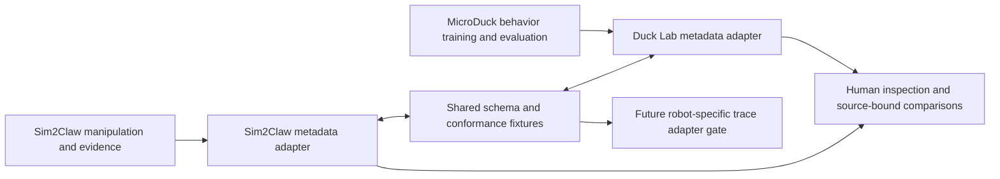

# Sim2Claw and training dojo adapter contract

Owner request, 2026-09-05: codesign the actively evolving Sim2Claw and MicroDuck
training workspaces so their responsibilities and tools remain compatible.
This is an additive software integration lane. Active training, checkpoints,
frozen source bindings, runtime environments and campaign authorities remain
owned by their native projects.

## Responsibilities and active ownership

| Workspace/task | Native responsibility | Integration responsibility |
| --- | --- | --- |
| Sim2Claw / Build agent operations CLI | SO-101 manipulation scene construction; reconstruction/metrology provenance; replay, contact/timing analysis and evidence validation; reviewed physical gateway | Own the neutral schema, Sim2Claw exporter/validator, shared conformance fixtures, operations-map integration |
| MicroDuck / Optimize microduck agent workspace | Duck Lab, behavior specifications, history lessons, readiness and retained training/evaluation visualization | Own the native Duck Lab adapter and peer conformance; preserve MicroDuck queue and work mode |
| MicroDuck / Analyze micro doc agent logs | Offline experiment preflight, concurrent-job observation and trace comparison in an isolated worktree | Supply diagnostic contract and first-divergence semantics; avoid duplicate implementations |
| MicroDuck / Set up training stack roadmap | Active local policy training, dynamic laser pursuit and eventual camera-driven control | Own training/environment/checkpoint changes and the actual behavior/evaluator gates |

The active peer tasks were inspected through the app, including their actual
user requests and live source files. Explicit owner direction authorizes this
coordination. MicroDuck's current `AGENTS.md` retires historical role cycles;
this adapter does not install or reactivate a Sim2Claw-style role loop there.
Sim2Claw remains closed at OR156; the operations feature branch correctly fails
its campaign's strict `main` identity check.

## Integration sequence and acceptance

1. Agree `robotics.workspace_exchange.v1` as a small, versioned JSON envelope.
   Keep native schemas, current-source ordering, proof classes and gate results.
2. Implement each exporter in its own lightweight CLI. Exchange files, never
   import the other repository's Python package or merge their environments.
3. Validate both real exports against the same schema and fixture set. Verify
   source hashes only against an explicitly supplied matching repository root.
4. Report metadata compatibility separately from robot/policy/action portability.
   Unknown versions, units, identities or native schemas never trigger execution.
5. Record both adapter owners, shared schema digest, native tests and a
   compatibility gate in each roadmap. A breaking change requires a new schema
   version, updated positive/negative fixtures and successful checks on both sides.

Current state: both native adapters implement the shared contract. Both readers
accept both real exports with explicitly bound producer roots; all 30 shared
fixtures pass in each implementation. The retained receipt is
`outputs/operations/adapter-bilateral-receipt.json` in Sim2Claw and
`docs/workspace/exchange/receipts/20260905/interop.json` in MicroDuck. These are
time-specific inspections. Later edits or commits require fresh exports.
See `adapter-verification.md` and `adapter-review.md` for the software gate.

## Domain constraints to retain

- A MicroDuck policy uses its frozen 61-dimensional observation contract,
  fourteen ordered actions and 50 Hz unfiltered interface. Genesis/Metal/MPS
  training and independent C MuJoCo/BAM evaluation have separate responsibilities.
  ONNX normalization, exact model variants and source bindings remain native.
- Sim2Claw has two six-actuator arms in its scene, while manipulation source
  episodes commonly command only the selected arm. The source-episode contract
  uses six absolute radian targets, float32 replay and 20 Hz zero-order hold.
  Exact recorded-replay manifests use their own timestamp and float64 identity.
- Physical gateway inputs are another interface: the first five values are
  degrees and the gripper is a calibrated 0–100 input. Historical field names
  containing `degrees` do not make the gripper a degree value. Conversions and
  clipping cannot be hidden inside a shared action adapter.
- A scene's actuator count does not establish a policy ABI. Runtime availability
  does not establish task success. Visible-development laser results do not
  establish pixel-driven control, blind held-out acceptance or physical transfer.
- A verified SHA256SUMS manifest does not establish evaluator semantics or cover
  arbitrary sibling artifacts. Refer to artifacts by workspace ID, relative
  path, hash and explicit integrity state. Native loopback viewer URLs are local
  UI routes, not portable artifact URLs.
- Native recorded training status and process liveness are separate. A snapshot
  with `process_liveness=not_checked` remains unchecked. Source queues and status
  documents can temporarily disagree during concurrent work; preserve their
  identities and ordering rather than inventing one authoritative completion.

## Diagnostic interface supplied by the peer agent

The complementary diagnostic was developed in the isolated MicroDuck branch
`codex/experiment-diagnostics` and landed in MicroDuck `main` at `578aa31`,
under `experiment_ops/` and `scripts/duck-ops`. Its native contract is
`docs/experiment-ops/INTEROPERABILITY.md` and its retained inspection summary is
`docs/experiment-ops/validation-20260905.json` in that repository.
Its output schema is `microduck.ops.trace-comparison.v1`. Inputs include case ID,
strictly increasing per-case simulated timestamps, optional ordered `action_rad`,
commands, positions, targets, visibility/fall events and contacts.

Its comparisons distinguish `fixed_recorded_actions`,
`different_recorded_actions`, `incomplete_or_misaligned` and
`action_telemetry_missing`. Parsed JSON float64 value identity is not original
tensor-byte or dtype identity. The receipt binds paths, SHA-256, row/byte counts,
first differences and source line numbers. `physics_causality=not_established`,
`behavior_acceptance=not_evaluated` and false hardware authority remain intact.
Reset, frame, model, observation, actuator and force provenance require separate
inspection before making causal claims. The peer's process guard is advisory
PS/lsof observation; it does not signal processes or grant leases.

## Growth contract

Shared now: metadata discovery, evidence references, source identity, capability
descriptions, native schema declarations and explicit limitations. Future
robot-specific scene/task/trace adapters require separate dimensional, frame,
unit, clock and evaluator conformance. A MicroDuck behavior training result
cannot be loaded as an SO-101 policy by renaming fields.

Every integration change should identify its owner, producer/consumer schema
versions, migration boundary, negative fixtures and test receipt. Both projects
retain their own ordered queues; the compatibility gate is a dependency shared
by those queues, not a second autonomous controller.

## Operator commands

```bash
uv run --locked sim2claw ops --json adapter export > outputs/operations/sim2claw-workspace-exchange.json
uv run --locked sim2claw ops adapter conformance
uv run --locked sim2claw ops adapter check /path/to/peer.json --source-root /path/to/producer
uv run --locked sim2claw ops adapter compare /path/to/peer.json --peer-root /path/to/producer
```

Validation without a producer root is explicitly `unchecked` for source bytes.
With a producer root, every referenced file and the declared Git HEAD must match.
A dirty checkout can still provide exact bound bytes; it is disclosed, not
mistaken for a committed snapshot. Native gate refusal is valid metadata and
does not become execution admission. Inspection never imports either simulator.

The shared schema is `configs/operations/workspace_adapter.v1.schema.json`,
SHA-256 `7f6115335dac03c0493940ed9f63d1aba0c741ba55defd434b5208acedf52bf0`.
The adjacent fixture pack contains 30 synthetic cases: three valid envelopes
and 27 rejection cases. Its fixture hashes are artificial; source verification
must remain unchecked. Keep schema and fixtures byte-identical in both native
repositories and compare their digests when running bilateral checks.

MicroDuck mirrors them under `docs/workspace/exchange/` and provides
`./scripts/duck exchange-export --owner-task <task-id>`,
`./scripts/duck exchange-inspect FILE --source-root ROOT`, and
`./scripts/duck exchange-conformance`. Its native adapter is
`duck_workspace/exchange.py`; its ownership/versioning guide and measured
checks are `docs/workspace/exchange/README.md` and `CONFORMANCE.md`.

The readers have local validation differences. Keep portable exports within
Sim2Claw's smaller limits (1 MiB packet, 4 MiB per referenced source).
MicroDuck also verifies declared branch identity and unique canonical source
paths; Sim2Claw verifies source hashes and HEAD. Shared-fixture success proves
agreement on the retained cases, not every possible JSON input. Source identity
does not authenticate a publisher or certify native evaluator semantics.



The next gates are ordered: metadata exchange first; separately bound diagnostic
traces second; scene/task recipe interchange third; measured reuse benefits
last. Trace admission requires explicit reset/model/frame/clock/action provenance
and independent rejection fixtures. Recipe admission also requires a native
evaluator and scene compiler in each project. Measure context preparation time,
repeated failed attempts, review corrections and accepted task outcomes against
retained baselines before claiming either integration accelerates training.
