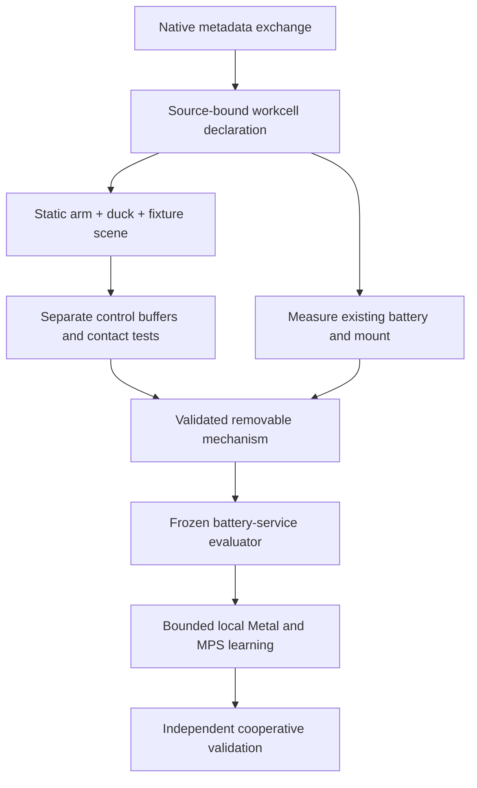

# Arm and duck shared simulated workcell

The long-term task is to simulate and train an SO-101 arm to change the
MicroDuck's battery. The owner selected **existing battery hardware** on
2026-09-05. A redesigned cartridge or mount is not the target. No physical task
is authorized or proven by this document.

The immediate deliverable is the source-bound declaration in
`configs/operations/arm_duck_workcell.v1.json` and the non-simulating
`sim2claw ops workcell` inspector. It verifies native interfaces and previews
an integer control schedule. It neither builds a physics world nor routes
actual actions. The preceding metadata exchange is documented in
[DOJO_ADAPTER.md](DOJO_ADAPTER.md).

## Responsibility and repository boundaries

| Area | Native owner | Shared boundary |
| --- | --- | --- |
| Arm models, manipulation, contact/replay and workcell evaluation | Sim2Claw | One explicitly selected SO-101 model, its source identity and separate action buffer |
| Duck model, locomotion, posture, docking and behavior training | MicroDuck RL Genesis | Explicit robot variant, fourteen-action interface, home pose and native evaluator |
| Scene assembly, frame graph, physics clock and collision-pair tests | New isolated integration module | Shared recipe and validation receipts; neither native training environment is imported |
| Existing battery mechanism and service fixture | Measured hardware requirements, then separately reviewed simulation variant | Part identity, geometry, mass, retention, insertion/extraction and electrical-state evidence |
| Compute admission and artifacts | Task owning the bounded run | One native runtime, explicit budget, hashes, telemetry and teardown rule |

The repositories remain separate Git histories. They share small versioned
contracts and retain their own queues. MicroDuck's current active training work
keeps its priority; this long-term service task does not silently replace it.
The separate physical MicroDuck control repository is outside this work.

## Exact interfaces to preserve

| Property | SO-101 arm | MicroDuck |
| --- | --- | --- |
| Controlled values | Six: five positioning joints plus gripper | Fourteen articulated joint actions; free-base state is separate |
| Native action | Absolute radian joint targets | Unfiltered radian deltas from the frozen home pose |
| Native source type | float32 source episode | float32, shape `[1,14]` |
| Current control rate | 20 Hz | 50 Hz |
| Proposed shared physics step | 0.005 s | 0.005 s |
| Update on integer ticks | Every 10 ticks | Every 4 ticks |
| Entity namespace | `arm_` | `duck_` |

A 20-tick planning window is 0.1 simulated seconds. In its half-open interval,
arm updates occur at ticks 0 and 10; duck updates at 0, 4, 8, 12 and 16. This
is a proposed scheduling contract, not a measured runtime result. Each actor
holds its own command between updates. Original trace identity must retain
its own timestamps; this new schedule does not authorize historical resampling.
Twenty action values do not describe the combined simulator's full `nq`/`nv`.

The shared frame convention is metres, positive-Z up and `wxyz` quaternions.
World, fixture, arm base, duck base and battery-mount frames are named, while
physical transforms remain explicitly unmeasured. No guessed transform is
presented as calibration. Observation dimensions that happen to match are not
interchangeable feature layouts.

## Mechanical facts and open measurements

The existing MicroDuck `robot_allcollisions.xml` contains `np_f970` battery
geometry inside `trunk_base`. It has no separate removable battery body/joint,
and its inertia is part of the trunk aggregate. The walking model includes
battery visuals without the corresponding battery collision. A mesh name does
not verify the owner's actual part identity, dimensions or mass.

The `power_support` collision class uses bit 2. In a combined native MuJoCo
model, ordinary mask matching will not connect it to default bit-1 arm geoms.
Genesis has different cross-entity behavior: its MJCF documentation scopes
those filters to the imported entity and notes limits for primitive/MJCF pairs.
Shared-scene import must therefore test the intended arm/duck/mount/fixture
pairs separately in each backend. A rendered overlap is not contact evidence,
and locomotion collision masks cannot silently become a manipulation contract.

Before modeling removal, measure the actual battery and mount: mass, centre
of mass, inertia or its derivation, graspable surfaces, latch access and force,
connector alignment, insertion/extraction direction, travel, tolerances,
retention and allowable contact loads. Splitting the battery from the trunk
requires reconciling the remaining trunk inertia without double-counting mass.
Existing frozen assets remain immutable; a new isolated variant must document
its derivation and measured changes.

The arm has five positioning axes, not a six-axis wrist plus gripper. Check
reachable grasp orientation, latch access and collision-free insertion before
training. A positional IK residual alone cannot establish that the arm can
perform the servicing sequence. A fixture can support and orient the existing
duck; its assumptions and contact effects need their own evidence. A fixture
does not imply permission to redesign the battery mount.

Mechanical insertion also does not establish correct electrical connection,
power continuity or a safe battery state. The simulation needs explicit power
and connector states and a separately owned evaluator. Physical electrical and
battery handling remain a later, independently reviewed hardware boundary.

## Ordered growth gates



| Gate | Required result | Evidence before advancing |
| --- | --- | --- |
| G0 Native workspace exchange | Two independently owned adapters agree on metadata and source identity | Both readers and the shared 30-case fixture corpus pass |
| G1 Workcell declaration | Direct native sources, action semantics, frames and proposed tick schedule are consistent | Non-simulating inspector and negative tests; ten direct source hashes |
| G2 Static assembly | One arm, one duck and a support fixture compile/render in an isolated scene | Full transitive mesh/include/license closure; unique names, correct dimensions/poses and explicit solver/contact settings |
| G3 Controlled interaction | Separate bounded scripted commands actuate only their intended actor | Action/observation/reset provenance, timestamped routing checks, joint limits, contact-pair and fixture characterization |
| G4 Existing mechanism | A removable battery model represents measured current hardware | Independent mass/inertia/geometry/retention/connector evidence and trunk mass reconciliation |
| G5 Service specification | Dock/stabilize, release, extract, park, replace, insert and verify have explicit success/failure conditions | Frozen phase evaluator; grasp/orientation/reach feasibility; missing-latch, misalignment, drop and power-state negatives |
| G6 Local learning | Scripted baselines and separately trained skills satisfy frozen development gates | Bounded local Mac runs, full source/checkpoint/seed identities and retained negatives; reserved suite frozen before tuning |
| G7 Cooperative validation | Duck docking/posture and arm servicing compose and recover from failures | Independent CPU reference checks and held-out composition; bounded NVIDIA validation only for a named unresolved local gate |

Hardware measurements can proceed independently while G2/G3 are developed.
No gate accepts itself: rendering, reward movement, metadata validity and replay
identity retain their separate meanings. Current G1 covers only the ten direct
sources in the recipe, not the full transitive asset closure required by G2.
The task is not currently a battery-removal simulator or trained capability.

## Local compute first

The inspected workstation is an Apple M3 Ultra with 96 GiB unified memory.
Use the existing independently pinned MicroDuck Apple lane as the first GPU
candidate: Genesis Metal for bulk physics and PyTorch MPS for learning. Keep
Sim2Claw's pinned CPU MuJoCo as the initial assembly/reference path. No new
simulator dependency or runtime environment is installed by this plan.

Create the shared scene in an isolated module. MicroDuck's active
`MicroduckVelocityEnv` resets/randomizes during construction, and its
`extra_morphs` are static decoration; neither is a suitable implicit owner of a
second controlled robot. Do not merge the legacy root requirements with the
Apple/CUDA locks or alter frozen exporter/evaluator sources to make it fit.

Measure one scene first, then small vectorized batches. Record build/warmup
cost, physics and learner time separately, transitions per second, peak unified
memory, failure counts and native-reference differences. Increase batch size
only while these measurements improve within a bounded run. Coordinate with
active training before consuming the shared GPU; CPU metadata inspection can
continue independently. GPU utilization alone is not learning progress.

Genesis supports Metal selection, but its MJCF importer does not preserve all
scene-wide simulation options automatically; explicitly set and test timestep,
integrator/solver and contact settings. See the upstream
[device API](https://genesis-world.readthedocs.io/en/v1.2.2/api_reference/utilities/device.html)
and [MJCF importer](https://genesis-world.readthedocs.io/en/latest/api_reference/engine/entity/morph/file_morph/mjcf.html).
These references guide a prospective adapter; the pinned installed version and
measured scene behavior decide acceptance. Do not add MJX solely for a GPU
label: upstream notes that individual scenes using MJX-JAX can run slower than
CPU MuJoCo and distinguishes the newer MJX-Warp backend's tradeoffs.
Benchmark any new backend against this actual workcell before adopting it.
[MuJoCo MJX documentation](https://mujoco.readthedocs.io/en/stable/mjx.html).

NVIDIA/Brev is the owner's last-resort inference/validation lane. Each use must
identify the unresolved local gate, exact inputs/checkpoint and cases, maximum
duration/cost, instance identity, retained outputs and stop/delete condition.
It must not become an unbounded default training lane. Stop or delete the
instance once the bounded job finishes and verify teardown through the native
Brev tool. A valid plan alone starts no instance and authorizes no hardware.

## Inspection and history

```bash
uv run --locked sim2claw ops workcell
uv run --locked sim2claw ops --json workcell --peer-root /path/to/microduck-rl-genesis
uv run --locked sim2claw ops git-health
uv run --locked sim2claw ops --root /path/to/microduck-rl-genesis git-health
```

Without an explicit peer root, peer sources remain unchecked. The Git report
uses object/index metadata, reports prospective new staged data, and never
removes existing evidence. `git-health --check` can require review before a
commit; ordinary inspection is advisory. Source and Git identity must be
refreshed after changes. The [artifact policy](artifact-policy.md) distinguishes
retained evidence and human annotations from rebuildable caches.
