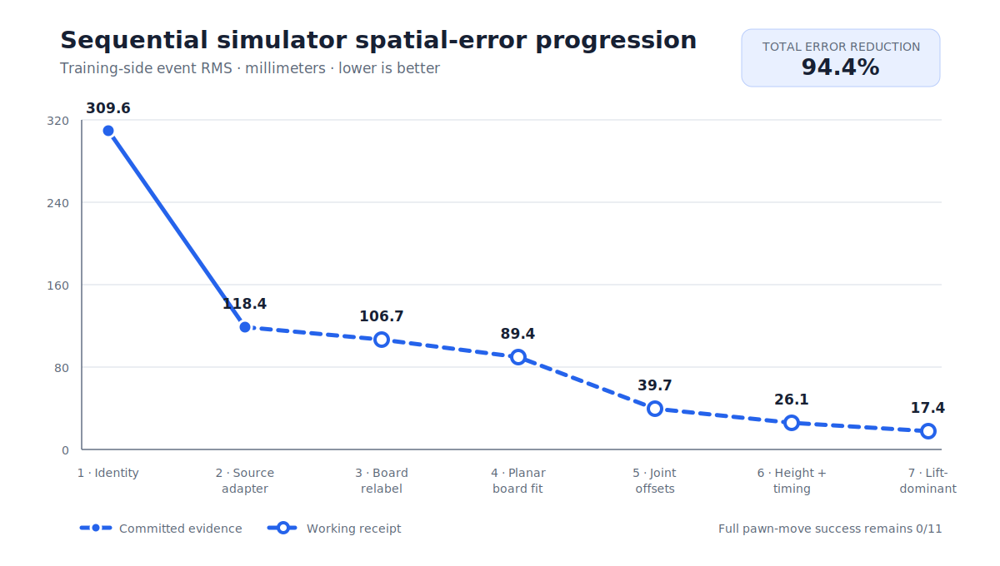

# Simulator and policy-training progression ledger

Date: 2026-07-19 America/Chicago

Machine-readable snapshot:
`docs/run-logs/2026-07-19-simulator-progression-ledger.json`.

## Figure guide

The figure has three aligned panels.

**Panel 1 — spatial-error progression.** Each point is one simulator
optimization action, annotated with what changed and its relative RMS
reduction. The actions group into three phases: *diagnose* (freeze the B-G
evaluator, replay the owner-reviewed commands, record the terminal negative),
*fit and reject* (the free-sign source adapter cut RMS 61.7% but was rejected
because its multi-radian offsets were physically implausible and produced no
contact), and the *staged workcell fit* (a categorical 180-degree board
relabel, a bounded planar board fit at yaw 184.9 degrees, bounded identity-sign
joint offsets, height/timing nuisance terms, and the selected lift-dominant
candidate with an 18.7-degree shoulder-lift offset). The final column is the
one-time held-out check of the frozen candidate, drawn as a within-split drop
from that split's own 327.5 mm baseline to 23.5 mm (a 92.8% reduction) against
the declared 60 mm kinematic-admission threshold. The held-out column is a
different data split, not a later step in the sequence: 23.5 mm on two unseen
sealed episodes versus 17.4 mm on the eleven fitted training episodes is the
expected generalization gap, evidence that the fit transfers rather than a
regression. The held-out set is now opened and must not be reused as fresh
evidence.

**Panel 2 — task consequences.** Selected-piece contact and lift fractions
under each candidate. Contact moves from 0/11 to 9/11 and lift to 1/11 only at
the final candidate; full pawn-move success remains 0 everywhere. This panel is
the reason spatial fit alone grants no training authority.

**Panel 3 — path to normalized GR00T training data.** The planned lane from
the frozen workcell candidate through committed receipts and tests,
regenerated B-G rank-1/rank-2 episodes, and a SHA-bound dataset with per-joint
normalization statistics, to a GR00T N1.7 fine-tune that would replace the
current mixture (one current-geometry pawn episode repeated 24 times as
sampling weight). Only the first stage has working-receipt evidence today; the
remaining stages are planned and carry no authority.

## Metric boundary

This ledger deliberately separates four metric families:

1. spatial event-fit error in meters;
2. command-driven replay consequences such as contact, lift, and task success;
3. actuator joint-tracking RMS in degrees;
4. learned-policy optimization loss and open-loop action error.

Values from different families are not interchangeable. Training loss is a
diagnostic of optimizer fit, not simulator fidelity or task success. A new
simulator or training revision should append a row with its Git commit,
contract/receipt identity, data split, proof state, and all available
consequence counts. Rejected and terminal-negative rows remain in the ledger.

## B-G spatial and replay progression

The chart treats each row as the next simulator optimization action on one
continuum. Its y-axis is training-side event RMS error in millimeters, so lower
is better. The first two points are committed evidence; the remaining points
are explicitly marked as working receipts from the active Claude worktree.

| Revision | Proof state | Split | Event RMS | Contact | Lift | Full success |
| --- | --- | --- | ---: | ---: | ---: | ---: |
| Provisional identity | committed terminal negative | train | 309.55 mm | 0/11 | 0/11 | 0/11 |
| Free-sign source adapter | committed rejected candidate | train | 118.42 mm | 0/11 | 0/11 | 0/11 |
| 180 degree board relabel | uncommitted working receipt | train | 106.71 mm | not replayed separately | not replayed separately | not replayed separately |
| Planar board fit | uncommitted working receipt | train | 89.41 mm | not replayed separately | not replayed separately | not replayed separately |
| Small joint offsets | uncommitted working receipt | train | 39.70 mm | 0/11 | 0/11 | 0/11 |
| Height and timing nuisance | uncommitted working receipt | train | 26.14 mm | 0/11 | 0/11 | 0/11 |
| Lift-dominant offset | uncommitted working receipt | train | 17.41 mm | 9/11 | 1/11 | 0/11 |
| Frozen lift-dominant candidate | uncommitted kinematic-only admission | held out | 23.55 mm | 2/2 | 0/2 | 0/2 |

The simulator became much closer in the event-fit metric, and the latest
working candidate finally produced contact. It has not produced a complete
pawn move. Its held-out admission is kinematic-only and does not grant policy,
training, physical-calibration, or physical-motion authority.

## Policy-loss evidence

Full per-step GR00T histories exist for the nominal 5,000-step chess run, the
1,000-step phase-progress challenger, the 1,000-step current-geometry pawn run,
and the 1,000-step multisource run. ACT retained only aggregate final and
last-100 loss values for its three recipes.

The ACT receipts demonstrate why loss must not select a model: recipe 1 has
the lowest final loss (`0.01674`) but failed its closed-loop episode, while
recipe 3 has higher final loss (`0.03175`) and passed only the narrow rook-lift
v1 evaluator. GR00T likewise reduced optimization loss substantially while
the separately owned task evaluators remained terminal-negative.

## Required fields for future rows

- timestamp and Git commit or explicit `uncommitted` state;
- simulator/configuration change;
- dataset and train/held-out split identity;
- receipt path plus SHA-256 when frozen;
- event-fit RMS when available;
- clipping, contact, lift, and strict-success counts;
- final target error and collateral/safety gates;
- optimizer loss and open-loop error only when a policy was actually trained;
- explicit proof class and promotion authority.
