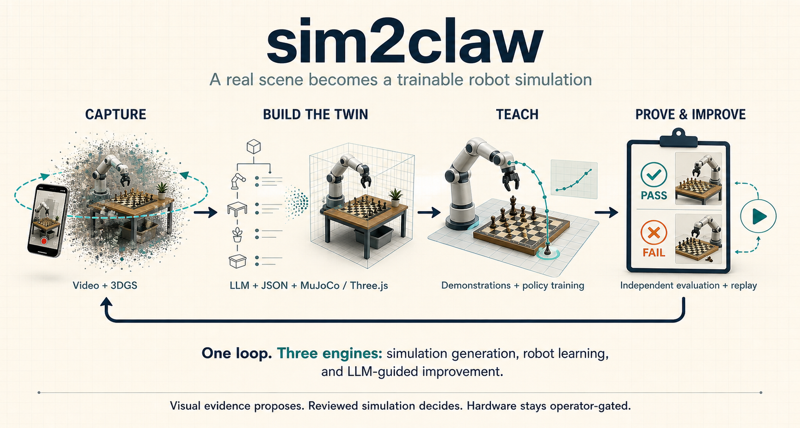
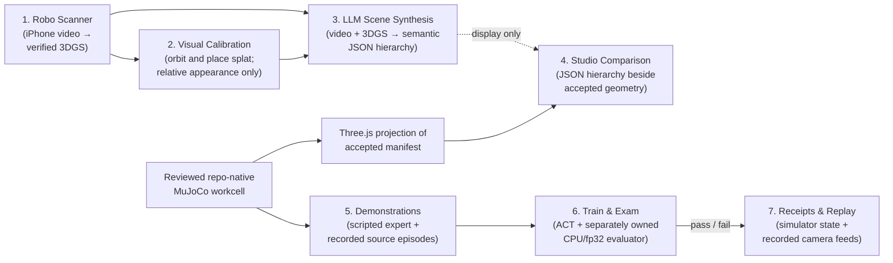

# Submission Checklist

## **Due:** July 19th at 11 AM **CST**

**Where to submit:** 👇

### Required

- [ ]  **Project title & Team Name**
  - sim2claw
- [ ]  **Track selected**
  - Recursive Intelligence Track
- [ ]  **2–5 min Loom video** (loom.com). Show the core loop live.
    - [ ]  **YOUR VIDEO MUST BE RECORDED WITH LOOM!**

    See **3-minute Loom script** below.

- [ ]  **Repo link** (Make sure it’s public!).
  - https://github.com/jakekinchen/sim2claw
    - [ ] Verify or change repository visibility before submission.
        - [x]  Must include a **README** with:
            - [x]  Quick start (commands to run)
            - [x]  Tech stack & architecture diagram (simple is fine)
            - [x]  How to reproduce the demo (env vars, API keys, sample .env)
            - [x]  Any **datasets/synthetic data** used + provenance
            - [x]  Known limitations & next steps
- [ ]  **Deployed URL (if any)** or short screen capture of the working app
- [ ]  **Team roster** (names, roles, contacts)
  - Aishwarya Badlani, Data Engineer, aishwarya08badlani@gmail.com
  - Jake Kinchen, Team Lead and Robotics Engineer, jakekinchen@gmail.com
  - Jeff Pape, Software Engineer, jeff.pape@gmail.com
  - Mahata Abhinav, Product Manager, Mahata.abhinav@gmail.com
- [ ]  **Short write-up (150–300 words):** problem → who it helps → solution → impact

**Problem.** Teaching a robot arm to manipulate a chess piece usually means brittle scripts that break when anything shifts or thousands of teleoperated task instances. Both scale badly, and many pipelines blur “we demonstrated this” with “the policy generalized,” making results hard to trust.

**Who it helps.** Robotics researchers, sim-to-real engineers, and anyone building learned manipulation who needs reproducible, honestly-scoped evidence rather than impressive-looking demos.

**Solution.** sim2claw is a clean-room simulation-to-robot stack. Robo Scanner turns an iPhone workcell video into a verified 334,537-splat Gaussian Splat. An LLM proposes objects, relationships, approximate geometry, and versioned JSON; Studio displays that proposal beside a Three.js projection built independently from the accepted MuJoCo manifest. MuJoCo alone owns geometry, joints, collision, contact, and task coordinates. The governing idea is to teleoperate grasp styles and corrections, then generate task instances combinatorially through object- and target-relative simulation retargeting. ACT learns contact-sensitive skills, while a separate CPU/fp32 evaluator on a held-out seed decides pass/fail. Studio keeps simulator-state replay distinct from synchronized camera recordings.

**Impact.** A fresh 957K-parameter ACT policy trained locally and lifted a held-out rook 94.88 mm. Separately, the primary 12-skill B--G pawn scorecard retains all 18 human-teleoperated source recordings but admits zero pawn poses until calibration and review exist; no B--G ACT checkpoint is claimed. Replay/system-ID gates likewise stop at 0/18 instead of fitting invalid coordinates. An operator-gated gateway exists, but there is no physical-task success, autonomous authority, or B--G learned-policy claim. Successes, failures, and blockers all become reusable research evidence.

## Two presentation levels

Lead with the simple overview. It explains the product as one loop without
making the audience learn the implementation vocabulary first.

### Simple overview — what it does

**One-sentence narration:** “sim2claw captures a real workcell, builds a
reviewable digital twin, teaches robot skills in simulation, then independently
tests and replays the results so the next version improves.”

Use this version for the opening, submission thumbnail, nontechnical judges,
and the first 30 seconds of the Loom recording. Its four ideas are deliberately
limited to **capture → build the twin → teach → prove and improve**.

### Technical overview — how it works

**One-sentence narration:** “Under that simple loop are three reviewable
engines: scene generation combines a visual 3DGS and display-only LLM hierarchy
with an independently accepted MuJoCo/Three.js twin; robot learning trains from
demonstrations and faces a frozen held-out evaluator; LLM orchestration deploys
bounded simulation runs, analyzes failures, and proposes the next versioned
dataset.”

Use this version for technical reviewers or as the second architecture slide.
The shared evidence plane makes the contract visible without repeating every
tool: JSON contracts, hashes, receipts, and deterministic Studio replay. LLM
and visual inputs propose; evaluator-owned gates and reviewed simulation state
decide.

## Detailed backup: full pipeline diagram

1. **Robo Scanner** — An owner-provided iPhone video becomes an immutable, checksummed 3D Gaussian Splat release.
2. **Visual calibration** — Studio renders the exact splat as an orbitable layer with relative translate, rotate, and scale controls. It does not define metric scale or collision geometry.
3. **LLM scene synthesis** — An LLM analyzes the source video and 3DGS to propose semantic nodes, relationships, and approximate geometry in a versioned JSON scene hierarchy.
4. **Studio comparison** — Studio displays the proposal hierarchy beside a Three.js projection generated independently from the accepted MuJoCo manifest. The current JSON is not compiled, promoted, or consumed to drive either geometry layer.
5. **Demonstrations** — Scripted experts and explicitly labeled recordings produce source episodes; recordings do not enter training automatically.
6. **Train and independent exam** — ACT learns contact-sensitive behavior, while a separate evaluator tests a held-out scenario that training never grades.
7. **Receipts & replay** — Studio keeps simulator-state inspection separate from synchronized source, overhead, side, and wrist recordings.

The key safety rule throughout: robot motion stays behind the reviewed, operator-gated gateway; recorded physical sources remain unqualified evidence, and a policy is only "good" if the independent exam says so.

## Technical implementation notes

The verified technical overview above replaces the older
`sim2claw-pipeline-poster-feedback-loop.png` and
`sim2claw-technical-architecture-poster.png`. Those two files are retired from
current-facing submission use because their rendered text contains obsolete
`GROOT` spelling and the feedback poster includes an illustrative score that is
not project evidence.

The current implementation stack is:

1. **Scene intake & calibration** — the clean-room Robo Scanner / `sim2claw iphone-3dgs` path uses public FFmpeg, COLMAP/GLOMAP/Ceres, and Brush tooling to turn an iPhone MOV into a checksummed Gaussian PLY plus preview, orbit, and manifest. Studio renders that visual layer with Spark 2.1 and Three.js.
2. **LLM scene proposal** — the LLM reviews source-video views and 3DGS appearance to propose a `sim2claw.llm_scene_synthesis.v1` hierarchy. Studio renders the hierarchy as read-only text beside the accepted scene; the code does not consume it to construct MuJoCo or Three.js geometry.
3. **Simulation scene** — a separately reviewed MuJoCo 3.10 workcell supplies board geometry, task coordinates, collision properties, and two SO-101 arms from MuJoCo Menagerie on a Python 3.12 + `uv` runtime.
4. **Demonstrations** — scripted IK experts (`chess_task`) and a 20 Hz teleop recorder built on LeRobot's SO-101 leader produce `samples.jsonl` plus a `recording_receipt.json`.
5. **Policy training** — an ACT conditional-VAE Transformer trains in PyTorch 2.11 on Apple MPS, emitting `checkpoint.pt` and a training receipt. A separate GR00T N1.7 lane exports LeRobot v2.1 Parquet + MP4 datasets (PyArrow); its bounded Brev A100 run completed 1000/1000 steps, but the sole frozen C8→A6 development rollout was terminal negative: 0 mm lift, 125.724 mm final XY error, and 13/15 gates. Held-outs remained sealed and checkpoint weights were not retained.
6. **Independent evaluation** — a separately owned CPU/fp32 evaluator applies frozen gates from `configs/tasks/*.json` and writes a per-gate pass/fail `evaluation_receipt.json`.
7. **Receipts & Studio** — every artifact carries a versioned JSON receipt (`sim2claw.*.v1` schemas). Studio provides interactive MuJoCo state replay, recorded video replay, multi-camera feed selection, and the separate 3DGS calibration workspace.
8. **Endpoint and calibration research** — a frozen B--G evaluator separates coarse, composable, and precision outcomes. The current corpus retains 18 recordings and 54 hash-bound assets, but zero base-center poses are admitted. Recorded replay requires measured initial velocity/units and exact unclipped controls; its canonical 0/18 readiness result blocks system identification rather than fabricating a calibration.
9. **Language/data gate** — twelve exact B--G move meanings and 24 deterministic prompt strings are frozen with group-before-expansion leakage controls. They add no behavioral evidence; zero admitted source groups means no new B--G GR00T training claim.

The B--G recordings above are leader/follower teleoperation sources, not learned
ACT rollouts. The held-out rook lift remains the only retained learned ACT
checkpoint result and is shown only as a narrow implementation proof.

Throughout, training never grades itself, and `physical_gateway` remains the only reviewed path to robot hardware.

## Detailed backup: scene synthesis

This older figure shows only capture and calibration into a simulation-facing
scene. It does **not** contain the later LLM/JSON proposal stage and must not be
used as evidence that JSON drives geometry. Use the verified simple and
technical overviews above for the current architecture; MuJoCo remains the
accepted geometry, collision, contact, and SO-101 simulation authority.

## 3-minute Loom script

Aim for a confident pace of about 140 words per minute. Text in brackets is an on-screen action, not narration. Keep the final recording between **2:50 and 3:10**.

### Before you hit record

- Open `README.md` (or this submittal checklist).
- Start Studio: `uv run sim2claw studio` → http://127.0.0.1:4173
- In Studio, queue the held-out ACT rook-lift evaluation from the Replay or Library view.
- Open Calibration and wait for the verified **334,537 splats · orbit to inspect** status.
- Open `sim2claw-simple-overview.png`; keep
  `sim2claw-technical-overview.png` ready as the technical follow-up.
- Record at 1080p with screen + microphone in Loom.
- Describe GR00T precisely: training completed **1000/1000**, but the sole frozen C8→A6 development rollout was terminal negative (**0 mm lift, 125.724 mm final XY error, 13/15 gates**); held-outs remained sealed and checkpoint weights were not retained. Do not claim GR00T policy success or physical task success.

### 0:00–0:20 — Hook

[Show the repository README and project title.]

“Teaching a robot to pick up a chess piece usually requires brittle hand-written motions or thousands of teleoperated examples. Even then, an impressive demo does not prove that the policy generalized. We built **sim2claw** to solve both problems: generating manipulation experience in simulation while producing trustworthy evidence for every result.”

### 0:20–0:55 — Core workflow

[Open Studio Calibration at http://127.0.0.1:4173/#/calibration, orbit the splat, then show the MuJoCo workcell.]

“The workflow starts with an iPhone workcell video processed through our Robo Scanner pipeline into this verified three-dimensional Gaussian Splat. Studio renders all 334,537 splats and lets us orbit and transform the visual capture. Reviewed MuJoCo geometry is available only as an optional comparison layer.

That splat is a visual calibration layer with relative scale; it does not make a metric or collision claim. A separately reviewed MuJoCo workcell owns the versioned chessboard, task coordinates, two articulated SO-101 arms, joints, friction, contact, and grasp behavior.”

### 0:55–1:30 — Technical depth

[Show the pipeline poster or scroll the architecture / pipeline section.]

“Scripted inverse-kinematics experts generate manipulation demonstrations. We also have a twenty-hertz teleoperation recorder built around Hugging Face LeRobot and the SO-101 embodiment.

A custom Action Chunking Transformer then learns the contact-sensitive behavior. The current ACT policy has approximately **957,000 parameters** and trains locally using PyTorch on Apple Silicon MPS.

Most importantly, training cannot promote itself. A separate CPU, float-thirty-two evaluator tests the frozen checkpoint on a held-out seed using thresholds defined before evaluation.”

### 1:30–1:58 — Live result

[In Studio, open the held-out ACT rook-lift episode. Toggle between **3D inspect** and **Recorded**.]

“This is the held-out evaluation. The newly trained policy lifts the rook **94.88 millimeters**.

That number is not taken from visual inspection. The evaluator writes an `evaluation_receipt.json` containing each measured gate, its threshold, and its pass-or-fail result. It also records the action trace, frames, and this replay video.”

### 1:58–2:25 — Technology and why

[Show the pipeline poster again; point at stack stages.]

“Every technology has a specific purpose. Robo Scanner and the Gaussian Splat provide real-video appearance context and an interactive visual-calibration surface. MuJoCo provides reviewed geometry and fast, contact-rich physics. LeRobot provides a reproducible interface for low-cost SO-101 hardware. PyTorch makes local ACT training practical.

We also ran a separate NVIDIA Isaac GR00T lane using LeRobot Parquet state and action data with MP4 observations. Brev training completed all one thousand steps, but its sole frozen C-eight-to-A-six development rollout was terminal negative: zero millimeters of lift, 125.724 millimeters final XY error, and thirteen of fifteen gates. Held-outs stayed sealed and checkpoint weights were not retained. That is a completed negative experiment, not learned-policy success.”

### 2:25–2:48 — Value and usability

[Return to Studio. Open the physical source episode and switch among Source overhead, Replay overhead, Replay side, and Replay wrist. Keep its **recorded, not admitted** proof label visible.]

“The useful output is not only a successful video. It is an auditable package of policy, measurements, receipts, and replay.

Successful evidence can advance a frozen milestone. Failed runs remain counterexamples and identify where targeted correction demonstrations are needed. They are never silently converted into successful imitation data.

A researcher can clone the public repository, bootstrap it with `uv`, reproduce the simulation, and inspect results in the read-only Studio.”

### Optional multi-view cutaway

[Within the existing timing, briefly show three labeled simulation clips and the physical command-replay clip. Keep the proof class visible; do not describe command replay as autonomous pawn capture.]

### 2:48–3:00 — Close

[Finish on the project title or pipeline poster.]

“sim2claw combines real-world scene capture, scalable simulation, learned control, and independent evaluation in one evidence-backed loop. It is optimized for fast iteration without weakening the exam. This is simulation-to-robot engineering that users—and judges—can trust.”
