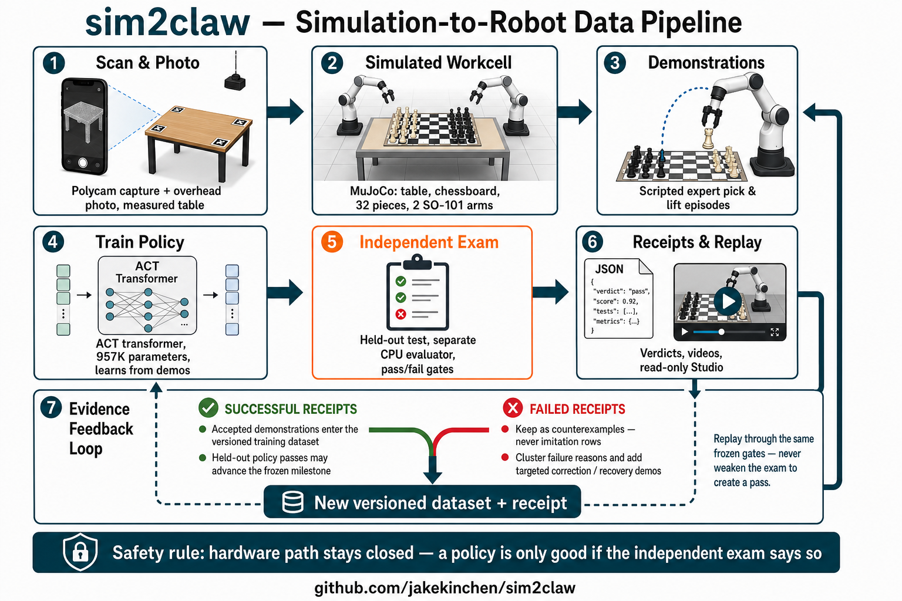
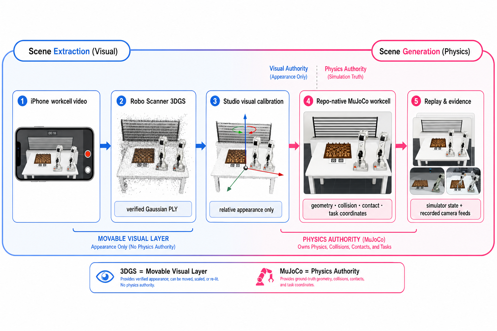

# Submission Checklist

## **Due:** July 19th at 11 AM **CST**

**Where to submit:** 👇

### Required

- [ ]  **Project title & Team Name**
  - sin2claw
- [ ]  **Track selected**
  - Recursive Intelligence Track
- [ ]  **2–5 min Loom video** (loom.com). Show the core loop live.
    - [ ]  **YOUR VIDEO MUST BE RECORDED WITH LOOM!**

    Demo Video Instructions

- [ ]  **Repo link** (Make sure it’s public!).
  - https://github.com/jakekinchen/sim2claw
    - NEED TO MSKE REPO PUBLIC repo is public
        - [ ]  Must include a **README** with:
            - [ ]  Quick start (commands to run)
            - [ ]  Tech stack & architecture diagram (simple is fine)
            - [ ]  How to reproduce the demo (env vars, API keys, sample .env)
            - [ ]  Any **datasets/synthetic data** used + provenance
            - [ ]  Known limitations & next steps
- [ ]  **Deployed URL (if any)** or short screen capture of the working app
- [ ]  **Team roster** (names, roles, contacts)
  - Aishwarya Badlani, Data Engineer, aishwarya08badlani@gmail.com
  - Jake Kinchen, Team Lead and Robotics Engineer, jakekinchen@gmail.com
  - Jeff Pape, Software Engineer, jeff.pape@gmail.com
  - Mahata Abhinav, Product Manager, Mahata.abhinav@gmail.com
- [ ]  **Short write-up (150–300 words):** problem → who it helps → solution → impact

**Problem.** Teaching a robot arm a manipulation task like picking up a chess piece usually means one of two bad options: hand-scripting brittle motions that break the moment anything shifts, or hand-teleoperating thousands of individual task instances to train a policy. Both scale badly, and most robot-learning pipelines blur the line between "we demonstrated this" and "the policy actually generalized," so results are hard to trust.

**Who it helps.** Robotics researchers, sim-to-real engineers, and anyone building learned manipulation who needs reproducible, honestly-scoped evidence rather than impressive-looking demos.

**Solution.** sim2claw is a clean-room simulation-to-robot stack. A photo-aligned MuJoCo workcell (measured table, chessboard, 32 dynamic pieces, two articulated SO-101 arms) runs entirely in-process on Apple Silicon. Its governing idea: teleoperate only grasp styles and corrections, then generate task instances combinatorially in simulation via object- and target-relative trajectory retargeting. A frozen ACT (Action Chunking Transformer) policy learns the contact-sensitive skills; a separate CPU/fp32 evaluator on a held-out seed decides pass/fail — a policy can never promote itself. A read-only visualization studio replays every episode with phase-aligned video and receipts.

**Impact.** It reaches a verifiable milestone — a fresh 957K-parameter ACT policy trained locally and lifted a held-out rook 94.88 mm — while rigorously refusing to overclaim: no gateway, no physical-robot authority, no "it generalized" without frozen held-out proof. The payoff is a trustworthy, reproducible foundation for learned manipulation, where each capability is backed by fresh code and its own evidence.

## Pipeline poster

The poster adds the evidence feedback loop after receipts and replay:

- **Successful receipts** — accepted demonstrations enter the versioned training dataset; held-out policy passes may advance the frozen milestone.
- **Failed receipts** — kept as counterexamples (never imitation rows); failure reasons are clustered to drive targeted correction and recovery demonstrations.
- Both paths produce a new versioned dataset and receipt, then replay through the same frozen evaluator gates.

## Technical architecture poster

This poster maps the concrete technologies behind each pipeline stage:

1. **Scene capture & build** — a Polycam scan (glTF + RoomPlan JSON) is converted by a custom glTF-to-OBJ converter and assembled into the `photo_aligned_chess_workcell_v1` MuJoCo 3.10 scene with SO-101 arms from MuJoCo Menagerie, all on a Python 3.12 + `uv` runtime.
2. **Demonstrations** — scripted IK experts (`chess_task`) and a 20 Hz teleop recorder built on LeRobot's SO-101 leader produce `samples.jsonl` plus a `recording_receipt.json`.
3. **Policy training** — an ACT conditional-VAE Transformer trains in PyTorch 2.11 on Apple MPS, emitting `checkpoint.pt` and a training receipt; a parallel GR00T N1.7 lane exports LeRobot v2.1 Parquet + MP4 datasets (PyArrow) for fine-tuning on NVIDIA A100 / CUDA 12.8.
4. **Independent evaluation** — a separately owned CPU/fp32 evaluator applies frozen gates from `configs/tasks/*.json` and writes a per-gate pass/fail `evaluation_receipt.json`.
5. **Receipts & Studio** — every artifact carries a versioned JSON receipt (`sim2claw.*.v1` schemas), replayable as FFmpeg-encoded MP4s in the read-only Studio (vanilla JS + Python HTTP server).

Throughout, training never grades itself, and `physical_gateway` remains the only reviewed path to robot hardware.

## Scene extraction figure

This figure shows the photo-aligned workcell path: Polycam capture → glTF / RoomPlan JSON / overhead photo → OBJ/MTL mesh and measured layout → MuJoCo procedural build with physics properties and SO-101 arms → photo-aligned simulation.

## 3-minute Loom script

Aim for a confident pace of about 140 words per minute. Text in brackets is an on-screen action, not narration. Keep the final recording between **2:50 and 3:10**.

### Before you hit record

- Open `README.md` (or this submittal checklist).
- Start Studio: `uv run sim2claw studio` → http://127.0.0.1:4173
- Queue the ACT evaluation MP4:
  `outputs/polycam_chess_table/act/chess_rook_lift_v1/eval/act_chess_rook_lift.mp4`
- Open the pipeline poster in this folder.
- Record at 1080p with screen + microphone in Loom.
- Do **not** claim a completed GR00T checkpoint or physical task success.

### 0:00–0:20 — Hook

[Show the repository README and project title.]

“Teaching a robot to pick up a chess piece usually requires brittle hand-written motions or thousands of teleoperated examples. Even then, an impressive demo does not prove that the policy generalized. We built **sim2claw** to solve both problems: generating manipulation experience in simulation while producing trustworthy evidence for every result.”

### 0:20–0:55 — Core workflow

[Open the Studio at http://127.0.0.1:4173 and show the workcell.]

“The workflow starts with a real table captured using Polycam. We use its glTF geometry, RoomPlan measurements, and an overhead photograph to construct a photo-aligned MuJoCo workcell.

The scene contains a measured table, a complete chessboard with numerous pieces, and two articulated SO-101 robot arms where one arm guides and the other arm follows. This is not merely a visual reconstruction. MuJoCo simulates joints, collisions, friction, contact, and grasp behavior.”

### 0:55–1:30 — Technical depth

[Show the pipeline poster or scroll the architecture / pipeline section.]

“Scripted inverse-kinematics experts generate manipulation demonstrations. We also have a twenty-hertz teleoperation recorder built around Hugging Face LeRobot and the SO-101 embodiment.

A custom Action Chunking Transformer then learns the contact-sensitive behavior. The current ACT policy has approximately **957,000 parameters** and trains locally using PyTorch on Apple Silicon MPS.

Most importantly, training cannot promote itself. A separate CPU, float-thirty-two evaluator tests the frozen checkpoint on a held-out seed using thresholds defined before evaluation.”

### 1:30–1:58 — Live result

[Play `outputs/polycam_chess_table/act/chess_rook_lift_v1/eval/act_chess_rook_lift.mp4`.]

“This is the held-out evaluation. The newly trained policy lifts the pawn **94.88 millimeters**.

That number is not taken from visual inspection. The evaluator writes an `evaluation_receipt.json` containing each measured gate, its threshold, and its pass-or-fail result. It also records the action trace, frames, and this replay video.”

### 1:58–2:25 — Technology and why

[Show the pipeline poster again; point at stack stages.]

“Every technology has a specific purpose. Polycam anchors simulation to measured reality. MuJoCo provides fast, contact-rich physics. LeRobot provides a reproducible interface for low-cost SO-101 hardware. PyTorch makes local ACT training practical.

We also export a separate LeRobot version-two-point-one dataset lane using Parquet state and action data with MP4 observations, designed for NVIDIA Isaac GR00T experimentation. We keep that lane separate from proven ACT results so unfinished training is never presented as evidence.”

### 2:25–2:48 — Value and usability

[Return to Studio and show receipts or replay entries.]

“The useful output is not only a successful video. It is an auditable package of policy, measurements, receipts, and replay.

Successful evidence can advance a frozen milestone. Failed runs remain counterexamples and identify where targeted correction demonstrations are needed. They are never silently converted into successful imitation data.

A researcher can clone the public repository, bootstrap it with `uv`, reproduce the simulation, and inspect results in the read-only Studio.”

### 2:48–3:18 — Capture on its own

[Show 3 simulated videos + real video showing arm capturing pawn on its own]

### 3:18-3:30 — Close

[Finish on the project title or pipeline poster.]

“sim2claw combines real-world scene capture, scalable simulation, learned control, and independent evaluation in one evidence-backed loop. It is optimized for fast iteration without weakening the exam. This is simulation-to-robot engineering that users—and judges—can trust.”

